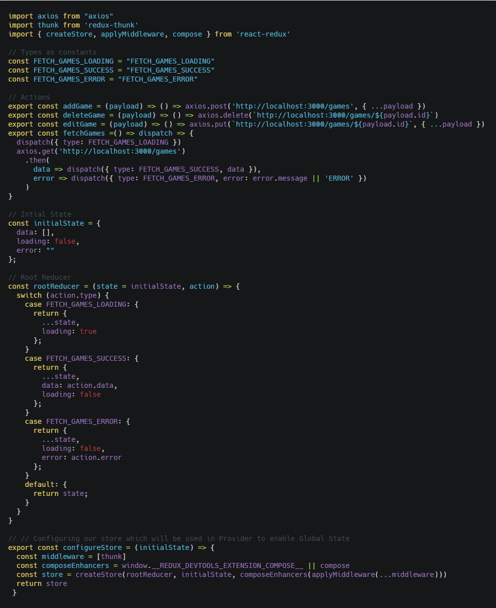
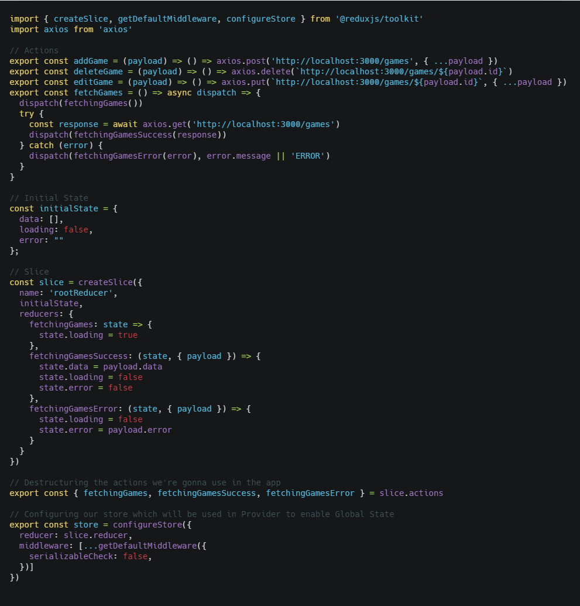

## Introduction

The Redux Toolkit package is intended to be the standard way to write Redux logic. It was originally created to help address three common concerns about Redux:

- "Configuring a Redux store is too complicated"
- "I have to add a lot of packages to get Redux to do anything useful"
- "Redux requires too much boilerplate code"

## Features

Redux Toolkit includes:

- A **configureStore()** function with simplified configuration options. It can automatically combine your slice reducers, adds whatever Redux middleware you supply, includes redux-thunk by default, and enables use of the Redux DevTools Extension.
- A **createReducer()** utility that lets you supply a lookup table of action types to case reducer functions, rather than writing switch statements. In addition, it automatically uses the [immer](https://github.com/mweststrate/immer) library to let you write simpler immutable updates with normal mutative code, like state.todos[3].completed = true.
- A **createAction()** utility that returns an action creator function for the given action type string. The function itself has toString() defined, so that it can be used in place of the type constant.
- A **createSlice()** function that accepts a set of reducer functions, a slice name, and an initial state value, and automatically generates a slice reducer with corresponding action creators and action types.
- The createSelector utility from the [Reselect](https://github.com/reduxjs/reselect) library, re-exported for ease of use.

## When to use

This is the default way of using Redux for almost every case, it's easier and the new utilities makes everything straight forward.

## Installing dependencies

For an already created project:

    yarn add @redux/toolkit

This also comes pre installed with a template for create-react-app

    npx create-react-app my-app --template redux
    cd my-app
    npm start

## Project structure

We're gonna do a ducks pattern here as it's the recomended way of doing Redux

- src
    - api
    - components
    - ducks
        - contacts
            - index.js
    - pages
    - store
    - App.js
    - index.js

## Difference between the original and the Redux Toolkit way

It's easier to see for ourselves the difference in code, lets check the original way:



The store is just here to show the difference. But as you can see it's the typical API, types, action creators, reducers and store.

Now lets check the new way with Redux Toolkit and explain what's going on:



Wait... where did the types, action creators and reducers go to?! They're all part of the slice!

The new createSlice takes as arguments the following:

    createSlice({
      name: 'nameOfTheSlice',
      state,
      reducers: {
        actionName: state => {
          // Do Something with the state
        },
        anotherActionName: state => {
          // With immer you can mutate the original state!
        }
      }
    })

So the magic happens inside the reducers key, what I call actionName is the name you would give the action in this context, so if it was:

```javascript
const initialState = {
  data: [],
  loading: false,
  error: ''
}
```

```javascript
// Action
fetchingGames = () => ({ type: 'FETCH_GAMES_REQUESTED' })
// Reducer
const rootReducer = (state = initialState, action) => {
  switch (action.type) {
    case FETCH_GAMES_REQUESTED:
      return {
        ...state,
        loading: true
      }
    default: return state
  }
}
```
You can do now:

```javascript
const slice = createSlice({
  name: 'rootReducer',
  initialState,
  reducers: {
    fetchingGames: state => state.loading = true
  }
})
```

But... don't we need the export the actions to our components to trigger the reducer? We can get the actions from the slice!

```javascript
// Destructuring the actions we're gonna use in the app
export const { fetchingGames } = slice.actions
```

If you ever need the types, for example, to use on Redux Saga, you can get it from the slice as well! The name is the name of the reducer and the name of the action, so in this case 'rootReducer/fetchingGames'

If you need to trigger any action you need to destructure the slice and import them in the component that's gonna use them, which will get trigger the reducer to change the global state.

## Conclusion

Thanks to [@acemarke](https://twitter.com/acemarke) for creating an easier way of using Redux, this is the default way of setting up our projects with Redux from now on, less code, more organized and easier to understand for new people, I personally took nearly four months before I understood Redux.

See you on the next post.

Sincerely,

**Eng Adrian Beria.**
