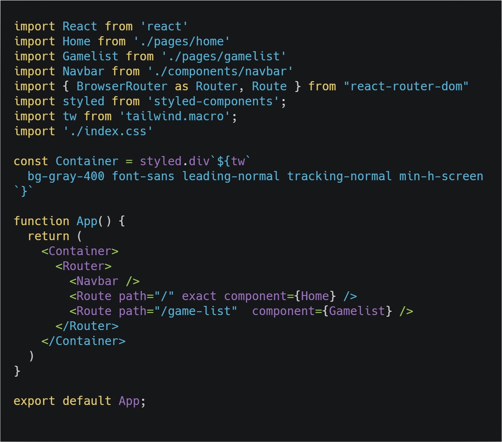
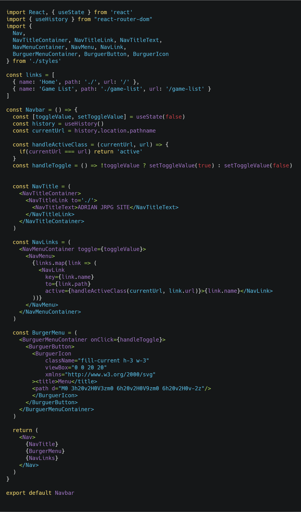
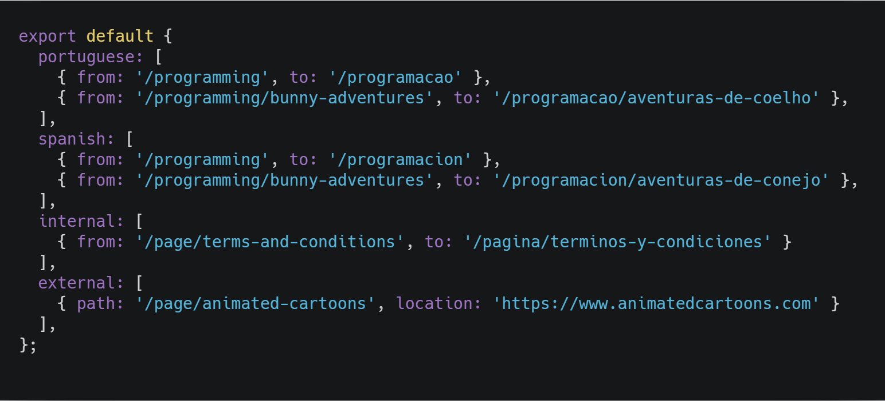
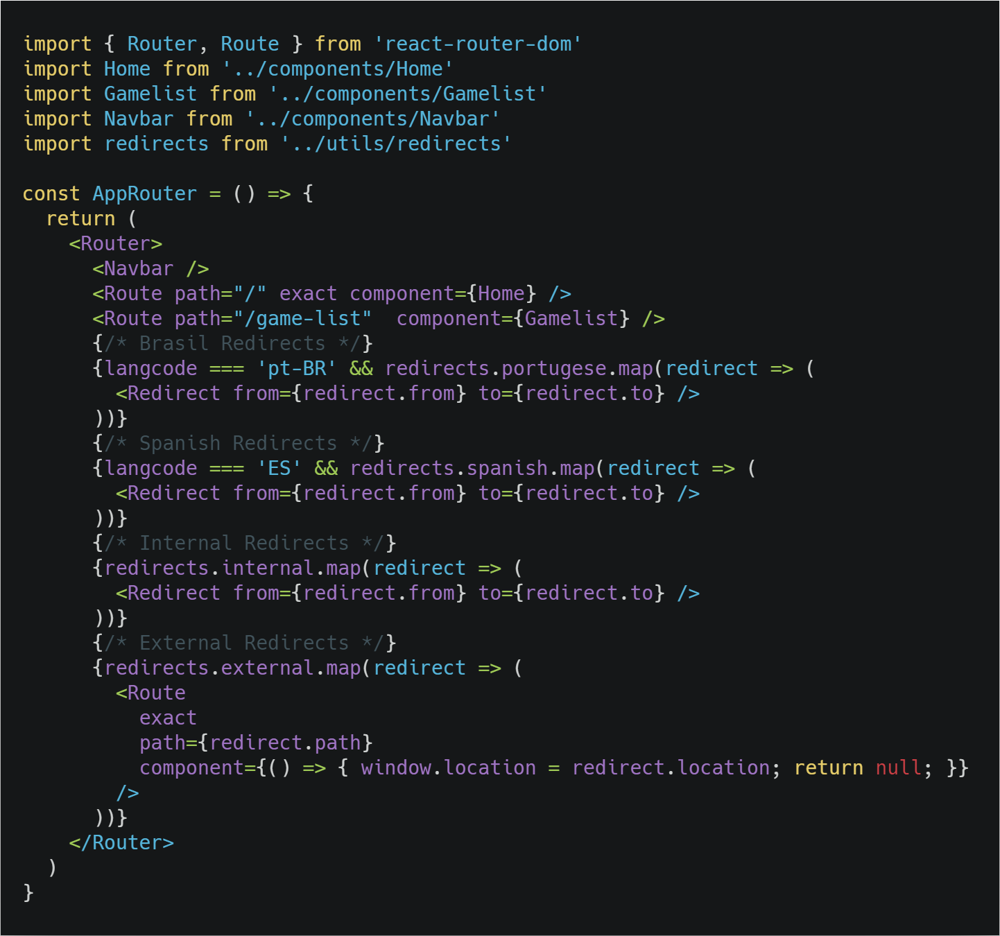

## Introduction

Routing is the capacity to show different pages to the user. That means the user can move between different parts of an application by entering a URL or clicking on an element.

As you may already know, by default, React comes without routing. And to enable it in our project, we need to add a library named react-router.

## When to use

When we need to connect different pages between each other.

## Installing dependencies

For an already created project:

    yarn add yarn add react-router-dom

## Project structure

We're gonna do a ducks pattern here as it's the recomended way of doing Redux

- src
    - api
    - components
    - ducks
        - contacts
            - index.js
    - pages
    - store
    - App.js
    - index.js

## How to use

We will show it applies to a Navbar since it's the most common case.

In App.js we **import { BrowserRouter as Router, Route } from "react-router-dom"**, where Router will be the container of our routing system, and Route will be the component in charge of saying which component to show at which link:



Where Router needs to have only one child instead of what was shown, so instead it will be like this:

```javascript
<BrowserRouter>
  <div>
    <Route path="/about" component={About} />
    <Route path="/contact" component={Contact} />
  </div>
</BrowserRouter>
```

The important part is this:

```javascript
<Route path="/" exact component={Home} />
```

Where path is the url path we're going to use for Home component, so when a user clicks the Link from react-router-dom and if it has assigned to the **to** prop, the same path url, then it will take the user to the desired path.

So... how do we actually manage our links? Inside Navbar of course! So inside we will import Link from react-router-dom:



The one called NavLink is a styled component with a custom name, it's actually the Link we were talking about. Notice the pattern it has:

```javascript
<NavLink
    key={link.name}
    to={link.path}
    active={handleActiveClass(currentUrl, link.url)}>{link.name}</NavLink>
```

Where the important prop is the "to" which indicates the path url we're going to use.

## Redirects

Sometimes when you work for a company they have to handle multiple languages so the URL can't look like "www.website.com/programacion" for the Portuguese version which should be "www.website.com/programacao", this is where redirects come in handy. I usually have a redirects.js file with the following structure:



And we can just map them easily:



Redirects are self explanatory, they require two props, **from** and **to**. As for how to handle different language, that's a post for another day.

## History

We can access the history of the URLs the user has visited.

```javascript
const history = useHistory()
```

## Nesting Routes

```javascript
<Route path="parent" component={Parent} />;

function Parent() {
  return (
    <div>
      <Route path="child" component={Child} />
      <Route path="other" component={Other} />
    </div>
  );
}
```

## Switch

When a <Switch> is rendered, it will only render the first child <Route> that matches the current location.

```javascript
// v4
const App = () => (
  <Switch>
    <Route exact path="/" component={Home} />
    <Route path="/about" component={About} />
    <Route path="/contact" component={Contact} />
  </Switch>
);
```

### Summary

- Import Router and Route inside App.js.
- Make Router your container and inside add all your routes, saying which path will be assigned to which component.
- Inside your Navbar, import Link and add it to your menus, so when they're clicked they will take you to the component you want, the **to** prop needs to be the same as the Route.

## Conclusion

We check how to use React Router.

See you on the next post.

Sincerely,

**Eng Adrian Beria.**
