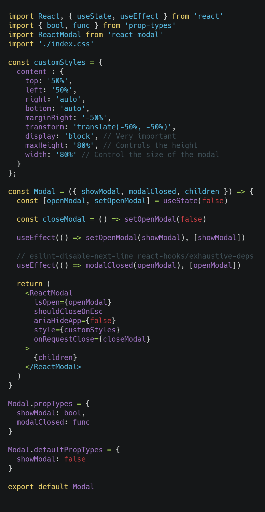

## Introduction

Modals are one of my favorite UX assets to use as a user and developer, having all the information available in one place presented in an elegant way makes it more pleasant for me. We're going to check how to use modals using the library react-modal, which has more than one million weekly downloads and has a weight of 11.2kb, two aspects that are important when choosing a library.

## When to use

The answer is whenever you need it, this is up to the designer in most cases, but I personally use it for forms and making UX more pleasant.

## Installing dependencies

For an alredy created project:

    yarn add react-modal

## How to use

We will use the [doc example](https://github.com/reactjs/react-modal) and expand on it.

In the component we **import Modal from "react-modal"**, which will act as a container for any children it has, making it versatile and reusable, lets see an example:



Lets check the most important props here:

- **isOpen**: Function that when return true opens the Modal.
- **shouldCloseOnEsc**: Allows the ESC button to be used, BUT it only works onRequestClose is used.
- **onRequestClose**: Function that when false close modal. Allows ESC and clicking outside the container, to be enabled.
- **style**: We need to add some base styles, but one of the most important is the display: block, because it allows the childrens to display better on the container. You can also move the Modal from the center to other positions.

### Summary

- Create a component named ReactModal that uses Modal from react-modal.
- Create a state that controls the activation of the modal, in this case **const [openModal, setOpenModal] = useState(false)** and assign it to **isOpen**.
- Create a function **const closeModal = () => setOpenModal(false)** and assign it to **onRequestClose**.
- Create a style object, a casual one can be:

```javascript
const customStyles = {
  content : {
    top: '50%',
    left: '50%',
    right: 'auto',
    bottom: 'auto',
    marginRight: '-50%',
    transform: 'translate(-50%, -50%)',
    display: 'block',
    maxHeight: '100%',
    maxwidth: '100%'
  }
};
```

## Conclusion

We have learned how to use Modals! They can be quite tricky to use and the using of position absolute can be a nightmare at first, but doing display block on the parent makes thing a lot smoother.

See you on the next post.

Sincerely,

**Eng Adrian Beria.**
