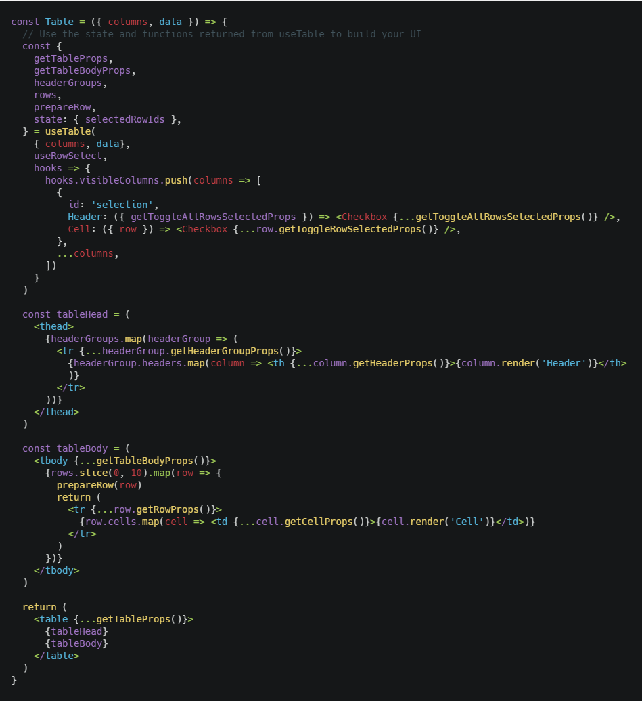
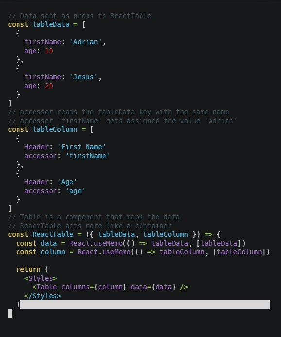

## Introduction

Using tables is a common way of introducing data into the UI, there are several tools available for the job, from UI only options inside CSS Frameworks like Material UI, Bootstrap, Bulma, etc, to actual libraries like [react-table](https://react-table.js.org/), which gives us many options to use and interact with the props in our components. In this post we will see a more in depth look.

## When to use

When we need to handle table data with tools like filtering, sorting, editing, pagination, all in one package.

## Installing dependencies

For an already created project:

    yarn add react-table

## How to use

Lets check the following code for a more visual representation and then explain what's going on:



This is our main component Table, now lets go from bottom to up. We have a HTML tag table as a container for the headers and body of the table because that's what tables are consist of.

If we check the header called in this case **tableHead**, we're mapping some... headerGroups? This array comes from react-table, more precisely **import { useTable, useRowSelect } from 'react-table'**, where useTable takes three parameters in this example, an object with **the column and data available which is sent by props**, we will see how it looks like, the second (optional) property useTables takes is the useRowSelect hook that comes from the same 'react-table' which is used for adding a checkbox to the tables, and talking about checkbox, the third (optional) property is a function that adds the checkbox to our table.

Easy right? useTable has the following props:

- **getTableProps**: We assign it to our **table HTML tag** which will act as a wrapper.
- **getTableBodyProps**: We assign it to our **tbody HTML tag** which will act as a wrapper.
- **headerGroups**: We assign it to our **thead HTML tag** which will act as a wrapper.
- **rows**: An array of materialized row objects from the original data array and columns passed into the table options
- **prepareRow**: This function is responsible for lazily preparing a row for rendering. Any row that you intend to render in your table needs to be passed to this function before every render.
- **state: { selectedRowIds }**

Those are the ones we used, for the rest of props check this [link](https://react-table.js.org/api/useTable) and for applied examples check [here](https://react-table.js.org/examples/simple).

If we check the code we put initially, in tableBody we're preparing the body with the properties to react to our needs, this is a mechanical process we do with our component everytime we want to use react-table.

Now to use this component:



The component we made before is called Table and it takes two props in this case, data and column, which are arrays of objects where **column** communicates with **data** through the accessor, then we need to memoize the data applying React.Memo which will prevent useless renderings and will only do it when the internal data changes.

If we need it to be responsive, like we should, then the docs has a great example in how to do it.

## Responsiveness

To make our table responsive we can add the following styled component:

```javascript
const TableContainer = styled.div`
  padding: 1rem;

  table {
    border-spacing: 0;
    border: 1px solid black;

    tr {
      :last-child {
        td {
          border-bottom: 0;
        }
      }
    }

    th,
    td {
      margin: 0;
      padding: 0.5rem;
      border-bottom: 1px solid black;
      border-right: 1px solid black;

      :last-child {
        border-right: 0;
      }
    }
  }
`
```

And use it as a container, this way in mobile we scroll horizontally.

## Summary

- import { useTable, useRowSelect } from 'react-table'.
- Create a styled component that acts as a container for the table to add responsiveness.
- In our component we apply useTable and its props to prepare the body and header to be applied the props of useTable.
- To use the component we send a memoized data and column with React.Memo.
- Check doc for more examples if we want to add filtering, sorting, edit, pagination, etc.

## Conclusion

We have learned how to use react-table v7! This was a long waited library I wanted to get my hands on as soon as possible because it gives us a lot of tools to create great tables with low work from our behalf reducing time in finishing the app you're working on.

See you on the next post.

Sincerely,

**Eng Adrian Beria.**
