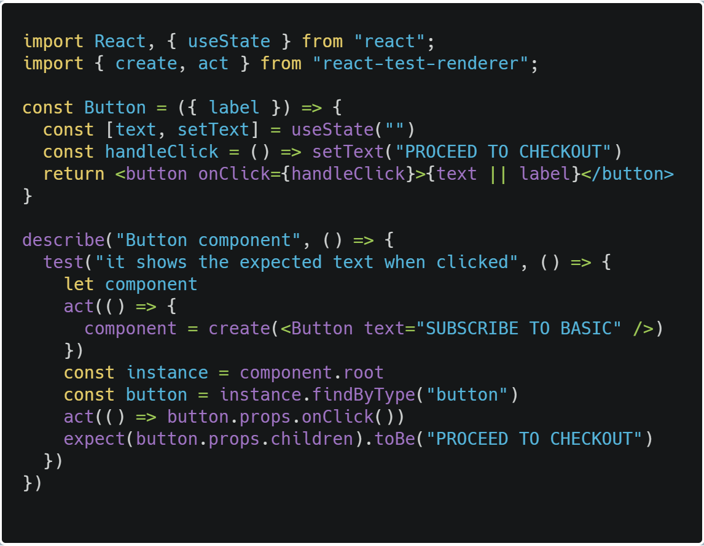
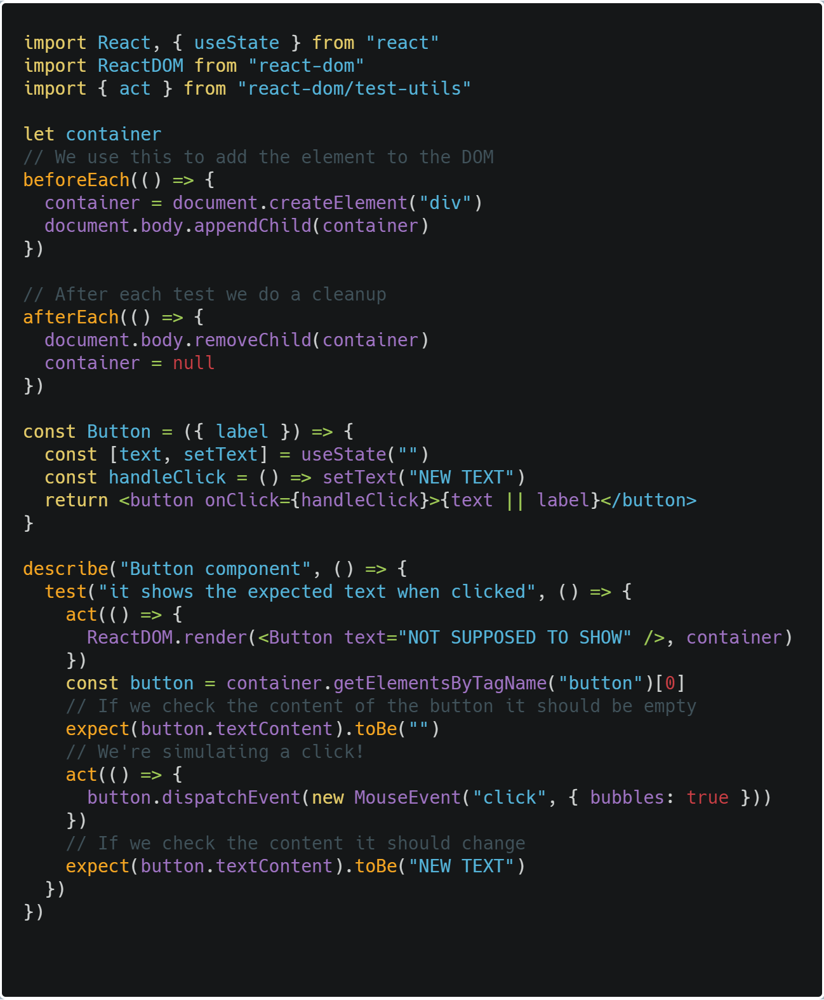
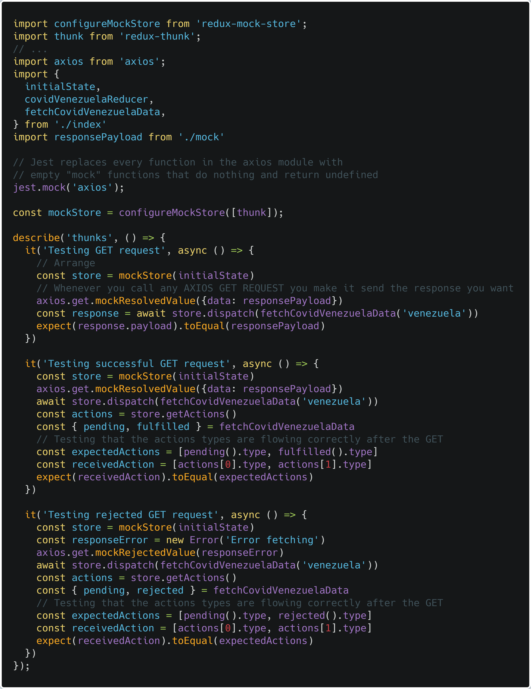

## Introduction

Testing is mandatory in almost every company, we will check about Unit Test, which allows us to check the functionality and behaviour of our functions, the idea is to mimic the user inputs instead of having them to do it themselves. It's easy to think that our components and functions will work because we wrote them to work and doing a test to see something we already know is a bit of waste of time, but it isn't the case and we will see why in this post.

## When to use

Everytime you make a project you need to have testing in them to be sure everything works correctly, from functionality to behavior.

## Installing dependencies

For an already created project:

    yarn add @testing-library/react react-test-render jest-dom

## How to use

Inside the components folder add a "__test__" folder which will contain the test with the name index.test.js, so when we use **yarn test**, it will check every file with the ".test." added to their name.

We're gonna check some examples.

## Testing without the DOM

For now lets check of the file would look:



- **describe**: Jest method for containing one or more related tests. Takes two arguments: a string for describing the test suite and a callback function for wrapping the actual test.
- **test**: The first argument is the test name, the second argument is a function that contains the expectations to test. The third argument (optional) is timeout (in milliseconds) for specifying how long to wait before aborting. Note: The default timeout is 5 seconds.
- **act**: To prepare a component for assertions, wrap the code rendering it and performing updates inside an act() call. This makes your test run closer to how React works in the browser. Look at the [API](https://reactjs.org/docs/test-utils.html) to find out more. **act** is available in react-test-renderer and on **react-dom/test-utils** and when imported from the latter it's possible to use ReactDOM.render, thus mounting the React component into the Document Object Model.
- **findByType**: Find a single descendant test instance with the provided type. If there is not exactly one test instance with the provided type, it will throw an error. Take a look at the [API](https://reactjs.org/docs/test-renderer.html) to find out more about the rest.

We're testing the functionality with this example, the button component when clicked it changes the text to "PROCEED TO CHECKOUT", to test this we call **describe** which will contain the **test** where we will use **act** from **react-test-renderer** to create the component, now we can access the props of the **html tag button**, in this case onClick and test if we **expect** the result of that test to be "PROCEED TO CHECKOUT".

## Testing with DOM

We will write a similar test but now with the DOM, the first step is to mount the component with **act()**



Very similar, only that now we will mount a div element and when the test is done we remove it. Now we use the first **act** to mount the Button in container, then we access the element button in container and now we can access its information, in this case **textContent** and see if we **expect it to be** "SUBSCRIBE TO BASIC", then we add another act where we click the button and see if the text changes.

Now in this case we learned that we can use **dispatchEvent** for clicking purpose and that it will change the button element making us simulate a user clicking a button. But of course this might seems bit simple, lets check a more fun example.

## Testing a fetch call

You can check the slice file we're testing [here](https://github.com/Radinax/covid-19-chart/blob/master/src/slices/index.js), notice we're using @reduxjs/toolkit.



Lets explain what's going on here, we basically make jest take over axios functionality and makes it return undefined values because we don't want to make a direct fetch, we only want to test. For this to work we made a mock store using the initial state as argument, then we made it so when a GET request in the test gets activated, it responds with the argument responsePayload. After that we dispatch the action which will trigger the Thunks and return the responsePayload and if everything is correct, both response payload and the result from making the GET request should be the same in this case.

Next we want to test the flow of our action types when a call is successful or not, the steps are similar, we create our mock store and make our GET requests respond with the object we gave it as argument, next we trigger the action and we store the actions inside a variable which comes from the store after dispatching the action, in this case we're interested only in the type so we put it inside an array which will look like:

```javascript
expectedActions = [
  'covidDataVenezuela/fetchingCovidDataVenezuela/pending',
  'covidDataVenezuela/fetchingCovidDataVenezuela/successful'
]
```
Which is again, the actions that we got from our fetchCovidVenezuelaData made from createAsyncThunk in our slice file which gives us the action types.

Next we will compare it with the actions from the store receivedAction which is what happens when we do a GET request, in theory it should give an array similar to above, which happens when we're doing the request and it's pending, and then after when it's successful or rejected. We tested both cases.

## Summary

Testing is a broad subject and we're going to take it one step a time, lets see what we learned:

- For testing a component without using the DOM we can use the ACT API to create the component and get its props to see if it works properly. We of course need to import the component into the test.
- For testing a component with DOM, we need to create a container with beforeEach test and then clean it up with afterEach. Next we render this component into the container and we access the omponent we want to test, if we want to simulate a click we use dispatchEvent and then we test what we need.
- For testing a Redux Thunks action, we need to intercept Axios with jest.mock, then create a fake store and make so that every GET request has the payload we want, then we dispatch the action and compare the payload. For testing the flowing of the actions we do the same, but this time we need to check if the action types are working correctly after doing a dispatch.

## Conclusion

We have learned how to test a button click, with DOM and without it, in most cases we will want to do it with the DOM since it's the most similar case to a user interaction. 

We also learned about testing a Redux Thunk Axios request, which is simply creating a fake store, intercept the GET request and make them respond with the value we want and then do the tests we need, in this case test if the payload gives the correct values and if the action types are flowing correctly.

See you on the next post.

Sincerely,

**Eng Adrian Beria.**
