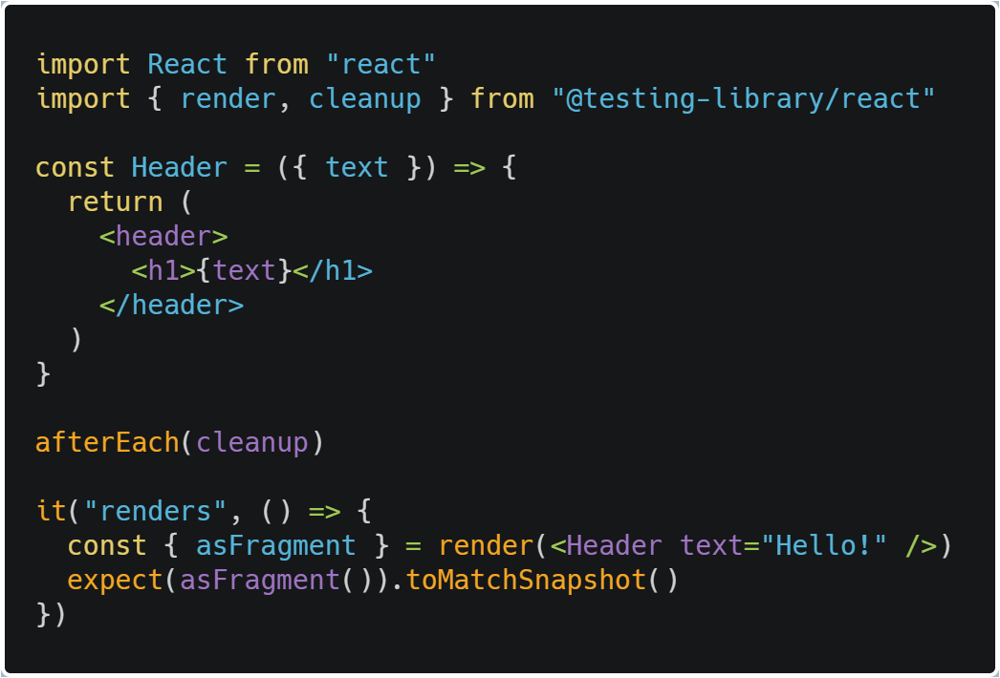
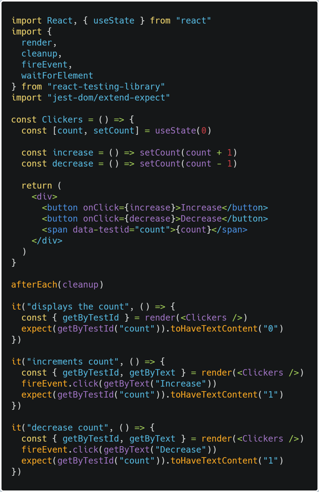
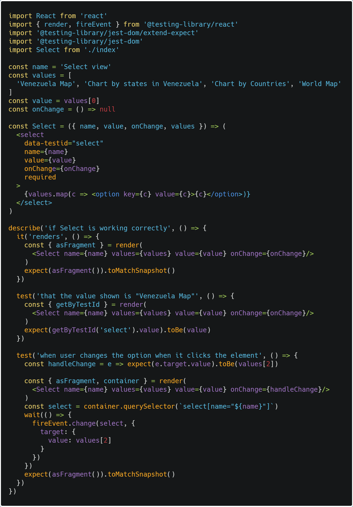

In our last post we talked about testing with jest, how to trigger events like a click, and see if it does any change, we also checked how to do an axios GET request and test it throughly. This time we will use a library called [react-testing-library](https://testing-library.com) which is alredy integrated in [create-react-app](https://create-react-app.dev/docs/getting-started/), it provides React specific testing tools  for snapshots, verifying DOM attributes or content, triggering click (or other) events, etc.

## When to use

It should be used all the time with Jest.

## Installing dependencies

It alredy comes with create-react-app installed, but if you need to install it in another project.

    yarn add @testing-library/react

## How to use

It's similar to how we tested in the previous post, but we will check some simple cases:

## Snapshots

> Snapshot tests allow you to take a snapshot (hence the name) of the HTML produced from your React component. By having this, you'll be made aware when you change your component in some way that does not produce the same output as you previously expected. If the output does differ, you can then make a decision to update the snapshot, or to fix your code so that no difference is found.



If we run **yarn test** we get a folder with the following content:

```javascript
exports[`renders 1`] = `
<DocumentFragment>
  <header>
    <h1>
      Hello!
    </h1>
  </header>
</DocumentFragment>
`;
```

## Firing events

The library comes with a function called fireEvent which handles various events as shown in its [documentation](https://github.com/testing-library/dom-testing-library/blob/master/src/event-map.js), from clicks, to hovers, inputs, double clicks, etc. Lets check an example of a counter.



Notice the **getByTestId** we're using to access the text here, we need to add an attribute called **data-testid** to the HTML tag we want to target.

From render we can get **getByTestId, container, getByText, getByLabelText, finishLoading**, you can check the others [here](https://testing-library.com/docs/dom-testing-library/api-queries#queries).

Before we move on, lets check getByTestId in more detail for this example:

```javascript
const Select = ({ name, value, onChange, values }) => (
  <select data-testid="select" name={name} value={value} onChange={onChange} required>
    {values.map(c => <option key={c} value={c}>{c}</option>)}
  </select>
)
```

In our test if we do:

```javascript
test('the select properties using getByTestId', () => {
  const { getByTestId } = render(
    <Select
      name={name}
      style={{ height: '1rem', margin: '1rem' }}
      values={values} value={value}
      onChange={onChange}
    />
  )
  console.log(getByTestId('select'))
})
```

Our console will give us a large amount of properties but this one is the important one:

```javascript
{ 'data-testid': 'select',
  style: { height: '1rem', margin: '1rem' },
  name: 'Select view',
  value: 'Venezuela Map',
  onChange: [Function: onChange],
  required: true,
  children: [ [Object], [Object], [Object], [Object] ]
}
```

We will see the context in the rest of this section, but with **getByTestId('select').value** we can access its "Venezuela Map" property! To access the properties of an element, we need to give it a name on the attribute **data-testid** and we just call it in our test!

## Integration test

> Is a level of software testing where individual units are combined and tested as a group. The purpose of this level of testing is to expose faults in the interaction between integrated units. Test drivers and test stubs are used to assist in Integration Testing.

These type of test is what we did in the last post with the **describe** method which contains multiple unit testing to check they're working in harmony, this time we will do an example with react-testing-library.

Now lets check a select input component and how to test it:



On this integration test we're testing what the user is seeing, first **is the component rendering**? What is **the value shown in the select**? How do we **change the option value**?

To check if its rendering we do a snapshot and see in the folder how it'll look.

To see what value is shown in the select we use **getTestById** to get the props of the select, in this case we can access its **value** property and if its the one we gave it initially in the render.

Finally we want to apply a change, to do this we need to **target the select element**, then execute the onChange event and see if the **e.target.value** we got from clicking is equal to the value we expect it to be, which works in this case!

## Summary

We took a step further into learning how to test, lets see what we learned:

- react-testing-library has all its methods wrapped on the ACT api we used last post.
- To execute snapshots we simply render the element and take the **asFragment** property from render and make a snapshot out of it.
- We need to test the initial state of the component and what happens when we make a change like doing a click event.
- For the select input we needed to target it and execute an event, to make sure it works properly we went inside the onChange function and see that the value we're sending it's the same as the one we expected it to be.

## Conclusion

We have learned how to test a counter and select component using react-testing-library, which is the accepted library to be used with jest to test our react components and testing the user interaction with the DOM.

See you on the next post.

Sincerely,

**Eng Adrian Beria.**
