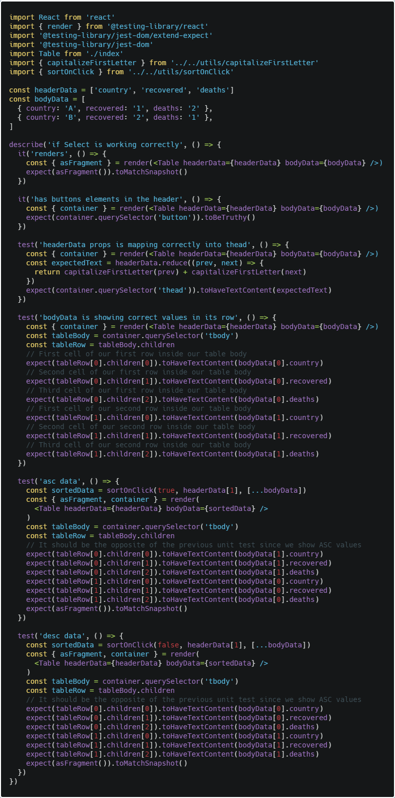

In our last post we talked about testing with jest with react-testing-library, we will continue with more components.

## Table

The table we want to test is shown [here live](https://radinax.github.io/covid-19-chart/) and the source code is [this](https://github.com/Radinax/covid-19-chart/blob/master/src/components/table/index.js), we want to test what the user see, in this case if it renders, if it has buttons on the header, if the body is showing the right data and that when we click the header it sort the data.

To check if it renders we do a Snapshot.

```javascript
const headerData = ['country', 'recovered', 'test']
const bodyData = [
  { country: 'Test', recovered: 'test', deaths: 'test' },
  { country: 'Test', recovered: 'test', deaths: 'test' },
]

it('renders', () => {
  const { asFragment } = render(<Table headerData={headerData} bodyData={bodyData} />)
  expect(asFragment()).toMatchSnapshot()
})
```

To check if it has buttons as elements in its header we use getByTestId.

```javascript
it('has buttons elements in the header', () => {
  const { container } = render(<Table headerData={headerData} bodyData={bodyData} />)
  expect(container.querySelector('button')).toBeTruthy()
})
```

Now lets show how the testing will look adding the other unit test:



Where the new skill we used was accessing the table cells, in this case we used container from rendering the Table and accessed the query 'thead' or 'tbody', then we just started accessing their children and see if its value matched the text we wanted.

## Summary

We took a step further into learning how to test, lets see what we learned:

- react-testing-library has all its methods wrapped on the ACT api we used last post.
- To execute snapshots we simply render the element and take the **asFragment** property from render and make a snapshot out of it.
- We need to test the initial state of the component and what happens when we make a change like doing a click event.
- For the select input we needed to target it and execute an event, to make sure it works properly we went inside the onChange function and see that the value we're sending it's the same as the one we expected it to be.

## Conclusion

We have learned how to test a counter and select component using react-testing-library, which is the accepted library to be used with jest to test our react components and testing the user interaction with the DOM.

See you on the next post.

Sincerely,

**Eng Adrian Beria.**
