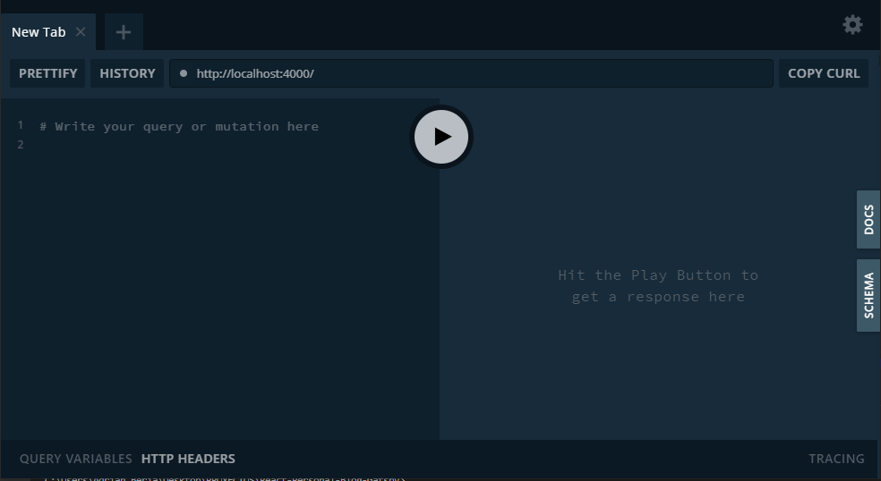
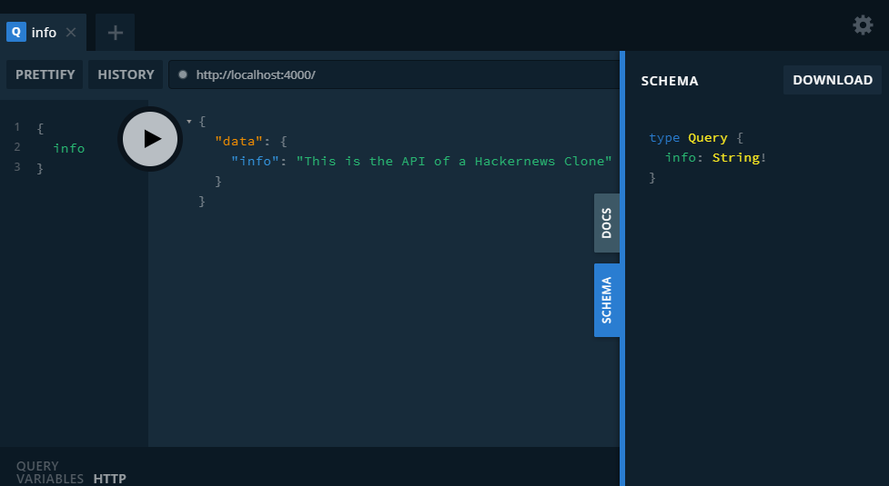
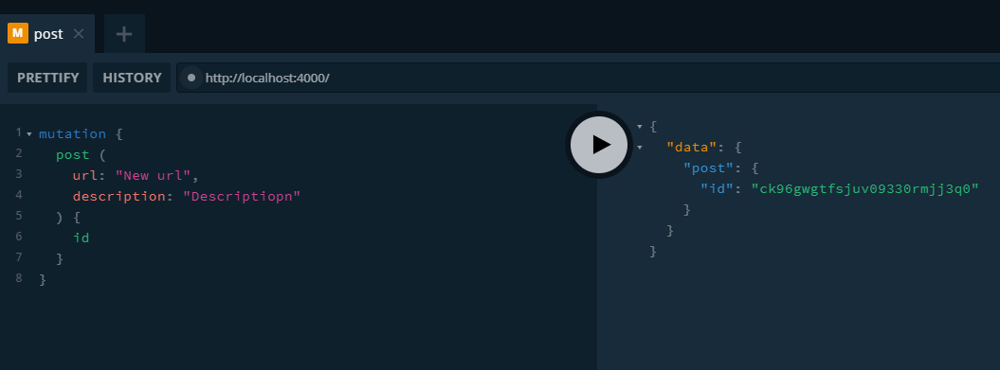
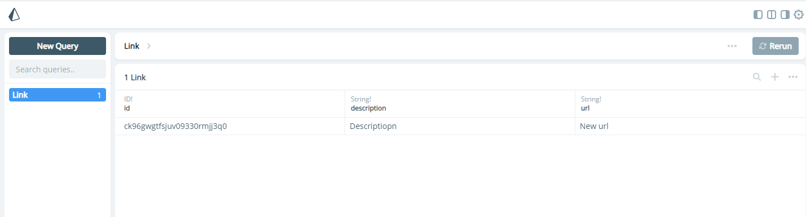

In the previous post we focused on the client, this time we will work on how to implement a server with GraphQL, Prisma and Express.

## Installing dependencies

    yarn add graphql-yoga
    yarn add prisma-client-lib
    yarn global add prisma

## File Structure

- prisma
    - datamodel.prisma
    - prisma.yml
- src
- package.json
- yarn.lock

## GraphQL Yoga

We will use [graphql-yoga](https://github.com/prisma-labs/graphql-yoga) on the server side. So what is this library?

> It's Fully-featured GraphQL Server with focus on easy setup, performance & great developer experience

It's based on the following libraries:

- express/apollo-server: Performant, extensible web server framework
- graphql-subscriptions/subscriptions-transport-ws: GraphQL subscriptions server
- graphql.js/graphql-tools: GraphQL engine & schema helpers
- graphql-playground: Interactive GraphQL IDE

This means it will do a lot of the work under the hood instead of manually doing everything from scratch.

## Get everything starting

- Create folder of project, inside do npm init and git init.
- Create a src folder with a index.js file inside
- yarn add graphql-yoga nodemon

Inside the index.js file we will put the following code:

```javascript
const { GraphQLServer } = require('graphql-yoga')

// Contains GraphQL type definitions
const typeDefs = `
  type Query {
    info: String!
  }
`
// Contains resolvers for the fields specified in typeDefs
const resolvers = {
  Query: {
    info: () => `This is the API of a Hackernews Clone`
  }
}

const server = new GraphQLServer({
  typeDefs,
  resolvers
})

server.start(() => console.log('Server running at https://localhost:4000'))
```

Inside our package.json we will add in our scripts:

```javascript
"scripts": {
  "server": "nodemon src/index.js"
}
```

Now, if we write on the terminal **yarn server** it will activate in our **https://localhost:4000** the graphql playground like this:



Now if we write a query and we hit the play button while clicking the schema tab, we get the requested information:



## Prisma

Let us add [Prisma](https://www.prisma.io/).

    yarn add prisma

> Prisma makes database access easy with an auto-generated and type-safe query builder that's tailored to your database schema. It provides an alternative to traditional ORMs and SQL query builders. Start with a new database or introspect an existing one to get started.

Where an ORM means:

> in computer science is a programming technique for converting data between incompatible type systems using object-oriented programming languages. This creates, in effect, a "virtual object database" that can be used from within the programming language.

Let's create a folder named **prisma** in our root and add two files:

- datamodel.prisma: It's where we will add our types and create associations and hook up the database. **This is what the database will recieve**.

```javascript
type Link {
  id: ID! @id
  createdAt: DateTime! @createdAt
  description: String!
  url: String!
}
```

- prisma.yml: It's where we will instruct prisma how to hit an endpoint and the infrastructure setup.

```javascript
endpoint: ''

datamodel: datamodel.prisma

generate:
  - generator: javascript-client
    output: ../src/generated/prisma-client
```

Now we deploy it from the command line with **prisma deploy** and it will give us the following options:

- Demo server + MySQL database: Free demo enviromenment hosted in Prsima Cloud (requires login)
- Use other server: Manually provide endpoint of a running Prisma server
- Use existing database: Connect to existing database
- Create new database: Set up a local database using Docker

We will use the demo server for now, you can login using your github account when prompted.

Now it will provide you the endpoint of your server!

Next we use **prisma generate** on the terminal to generate a folder inside src called **generated** which is the name we used in our prisma.yml file, inside that folder there will be a number of files of schemas and types definition that help us connect with MySQL.

## Finishing touches

With our prisma model hooked up, we can erase the links array, instead with our feed method we can access the context we passed as parameter and from it we can access Prisma, which gives us access to our links which are stored in the database.

```javascript
const resolvers = {
  Query: {
    info: () => `This is the API of a Hackernews Clone`,
    // feed: () => links
    feed: (root, args, context, info) => {
      return context.prisma.links()
    }
  }
  // Rest of code here
}
```

Now in our mutation we can refactor it to use the create link mutation that Prisma generates for us, which takes an url and description, which we can get from the args.

```javascript
const resolvers = {
  // Rest of code here
  Mutation: {
    post: (root, args, context) => {
      return context.prisma.createLink({
        url: args.url,
        description: args.description
      })
    }
  }
}
```

Now we want to add a context property to our server and then require the prisma client and assign it to the context property.

```javascript
const { prisma } = require('prisma-client-lib')

const server = new GraphQLServer({
  typeDefs: './src//schema.graphql',
  resolvers,
  context: { prisma }
})
```

Now in your terminal you should see your Prisma Admin address, go there to check your database, now activate **yarn server** and perform a mutation:



Hit the play button and now check your prisma admin:



And now it got updated! Our server is now complete!

## Summary

- Create project folder and inside open your code editor, then write npm init.
- Add nodemon and in your package.json add a script **"server": "nodemon node src/index.js"**,
- Add graphql-yoga, prisma-client-lib and add globally prisma.
- Create a folder called **prisma** on root and add two files named **datamodel.prisma** and **prisma.yml**.
- Create a **src** folder and add an **index.js** and **schema.graphql** files inside.
- Inside schema.graphql define your typeDefs.
- In your index.js file import **GraphQLServer** from **graphql-yoga** and create a **new GraphQLServer** which takes the **typeDefs** which accepts the route of the **schema.graphql** file, a context which takes **"prisma"** from **prisma-client-lib** and **resolvers**.
- Next define your resolvers and typeDefs.
- Define in your **prisma.yml** file the EP as empty string, datamodel.prisma file and the generate information needed.
- In your **datamodel.prisma** you define your types.
- In your terminal use **prisma deploy** and select demo for a simple project with MySQL.
- That's it!

## Conclusion

We managed to build ourselves a server with MySQL with the magic of Prisma! It makes thing really easy and let us focus more on how to manage our data, defining our types and resolvers, which we will use in our client to get the data.

See you on the next post.

Sincerely,

**Eng Adrian Beria.**
