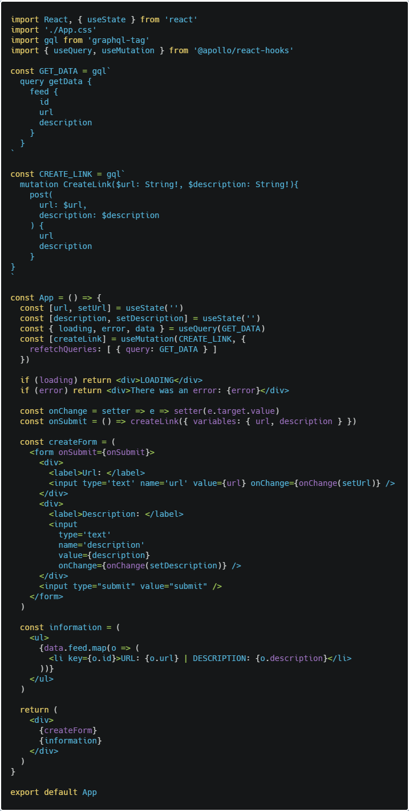

In the previous post we focused on how to build a server with prisma, graphql-yoga and MySQL. For this post we will focus on building the client side using the [post we made about it as reference](/18-apollo) and connect with the server we built.

## Installing dependencies

On the same project we worked on last post, write the following commands:

    npx create-react-app client
    cd client
    yarn add apollo-boost react-apollo graphql

## File Structure

- src
    - App.js
    - App.css
    - index.js

Erase everything until it looks like this.

Now configure index.js with Apollo Provider and use the EP provided by Prisma.

Inside App.js import everything necesary to perform a GET request like this:

```javascript
import React from 'react';
import './App.css';
import gql from 'graphql-tag'
import { useQuery } from '@apollo/react-hooks'

const GET_DATA = gql`
  query getData {
    feed {
      id
      description
      url
    }
  }
`

const App = () => {
  const { loading, error, data } = useQuery(GET_DATA)
  if (loading) return <div>LOADING</div>
  if (error) return <div>There was an error: {error}</div>
  console.log(data)
  return (
    <div>Test</div>
  )
}

export default App;
```

Check your console and you will see the information you requested!

Now lets add a POST query from the client side.



Remember our **post** inside the mutation was added in the resolvers of our server.

## Summary

- Have a server ready with Prisma
- In client side add the respective libraries and add Apollo Provider with its client
- In the app you can do queries or mutation based of the schema you made on the backend

## Conclusion

The goal of these posts was to create a small fullstack application with react-graphql-apollo-prisma-node-express-mysql, sounds like a lot of libraries but in practice it takes a few minutes to configure everything, this posts serve as reference when building quick apps.

See you on the next post.

Sincerely,

**Eng Adrian Beria.**
