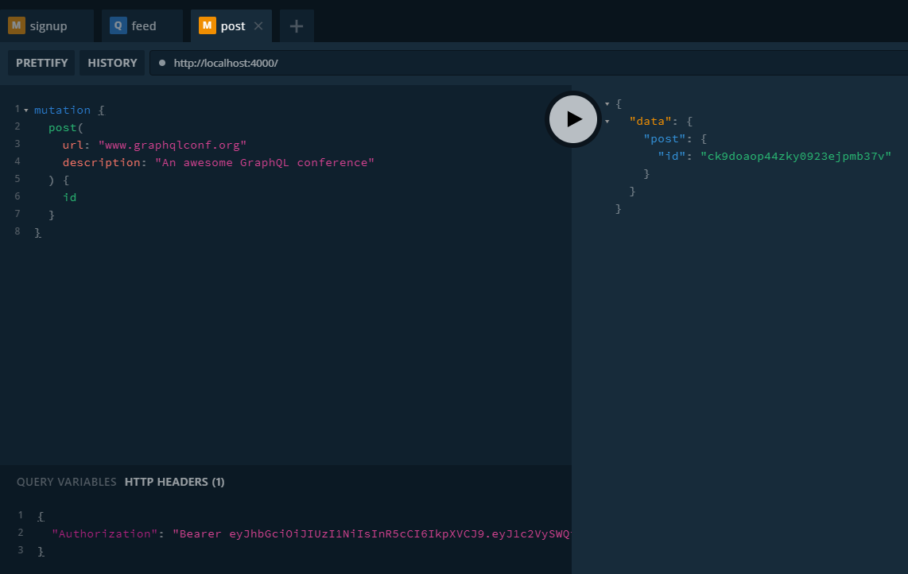

In the previous post we focused on how to build a fullstack application which makes a post request using a mutation to Prisma which reads the query and translates it to the database, in that case MySQL. Now we're going to add some modifications to the code we used by adding authentication, we will start on the backend first updating our datamodel, use the command **prisma deploy** to generate the update, then make the necesary changes to the schema typeDefs in sync with the changes in datamodel and then write the respective resolvers.

## Updating the datamodel

In datamodel.prisma we add the following information:

```javascript
type Link {
  id: ID! @id
  createdAt: DateTime! @createdAt
  description: String!
  url: String!
  postedBy: User
}

type User {
  id: ID! @id
  name: String!
  email: String! @unique
  password: String!
  links: [Link!]!
}
```

On your terminal use **prisma deploy**. 

## Updating your schema

In your schema add:

```javascript
type Link {
  id: ID! @id
  createdAt: DateTime! @createdAt
  description: String!
  url: String!
  postedBy: User // This is new
}

type Mutation {
  post(url: String!, description: String!): Link!
  signup(email: String!, password: String!, name: String!): AuthPayload // New
  login(email: String!, password: String!): AuthPayload // New
}

type AuthPayload {
  token: String
  user: User
}

type User {
  id: ID!
  name: String!
  email: String!
  links: [Link!]!
}
```

## Refactoring resolvers

The next step are resolvers, but with the way we're handling things in our root index.js we will have too much information, so it's better to handle the resolvers separately, so make the following changes on the folder structure on the root of your server:

- src
    - resolvers
        - Query.js
        - User.js
        - Mutations.js
        - Link.js

Now inside Query.js we add feed:

```javascript
function feed(parent, args, context, info) {
  return context.prisma.links()
}

module.exports = {
  feed,
}
```

Next comes our Mutations.js:

```javascript
const bcrypt = require('bcryptjs')
const jwt = require('jsonwebtoken')
const { APP_SECRET, getUserId } = require('../utils') // We add this in a second

async function signup(parent, args, context, info) {
  const hashedPassword = await bcrypt.hash(args.password, 10)
  const {password, ...user} = await context.prisma.createUser({ ...args, password: hashedPassword })

  const token = jwt.sign({ userId: user.id }, APP_SECRET)

  return {
    token,
    user,
  }
}

async function login(parent, args, context, info) {
  const {password, ...user} = await context.prisma.user({ email: args.email })
  if (!user) {
    throw new Error('No such user found')
  }

  const valid = await bcrypt.compare(args.password, password)
  if (!valid) {
    throw new Error('Invalid password')
  }

  const token = jwt.sign({ userId: user.id }, APP_SECRET)

  return {
    token,
    user,
  }
}

module.exports = {
  signup,
  login,
  post,
}
```

Lets explain step by step:

**signup**

- We encrypt the password using a library we will install soon.
- Use prisma-client to store the new User in the database by instanciating createUser.
- Generate a JWT signed with APP_SCRET. We need to install jwt for this.
- Finally we return the token and the user.

**login**

- We instantiate the user by getting its email only and throw an error if the user doesn't exist.
- We compare the input'd password to the one in the database, if they don't match throw another error.
- We return token and user.

## Adding a utils with the token

Create a utils.js inside the root of your server and add:

```javascript
const jwt = require('jsonwebtoken')
const APP_SECRET = 'GraphQL-is-aw3some'

function getUserId(context) {
  const Authorization = context.request.get('Authorization')
  if (Authorization) {
    const token = Authorization.replace('Bearer ', '')
    const { userId } = jwt.verify(token, APP_SECRET)
    return userId
  }

  throw new Error('Not authenticated')
}

module.exports = {
  APP_SECRET,
  getUserId,
}
```

In our GraphQL Server which comes from graphql-yoga we're accessing a request object on the context. However, when initializing the context, we’re really only attaching the prisma client instance to it - there’s no request object yet that could be accessed.

```javascript
const server = new GraphQLServer({
  typeDefs: './src/schema.graphql',
  resolvers,
  context: request => {
    return {
      ...request,
      prisma,
    }
  },
})
```

## Authentication in post mutation

Lets fix our post resolver in Mutation.js:

```javascript
function post(parent, args, context, info) {
  const userId = getUserId(context)
  return context.prisma.createLink({
    url: args.url,
    description: args.description,
    postedBy: { connect: { id: userId } },
  })
}
```

- We're now using getUserId which is stored in the JWT set at the Authorization header of the incoming HTTP request. 

- We also use userId to connect the Link to be created with the User who is creating it.

## Resolving relations

We need to ensure User and Link gets properly resolved. Since we added **postedBy** on **Link** and **links** on **User** we need to implement them in our GraphQL server.

On Link.js:

```javascript
function postedBy(parent, args, context) {
  return context.prisma.link({ id: parent.id }).postedBy()
}

module.exports = {
  postedBy,
}
```

In this resolver we're fetching Link using prisma client instance and invoke the postBy.

In User.js:

```javascript
function links(parent, args, context) {
  return context.prisma.user({ id: parent.id }).links()
}

module.exports = {
  links,
}
```

## Adding everything

Inside your root index.js replace your old resolvers with the new one:

```javascript
const Query = require('./resolvers/Query')
const Mutation = require('./resolvers/Mutation')
const User = require('./resolvers/User')
const Link = require('./resolvers/Link')

const resolvers = {
  Query,
  Mutation,
  User,
  Link
}
```

## Testing our work!

Lets test the signup feature:

```javascript
mutation {
  signup(
    name: "Alice"
    email: "alice@prisma.io"
    password: "graphql"
  ) {
    token
    user {
      id
    }
  }
}
```

Doing this answers us with a token, then we open another tab and we add the following query:

```javascript
mutation {
  post(
    url: "www.graphqlconf.org"
    description: "An awesome GraphQL conference"
  ) {
    id
  }
}
```

But where it says **HTTP HEADERS** on the bottom left of your screen add the token:

```javascript
{
  "Authorization": "Bearer INSERT_TOKEN_HERE"
}
```

And you get for response:



Great! Now we sign up! Now lets check the login with the data we used to sign up, send another query:

```javascript
mutation {
  login(
    email: "alice@prisma.io"
    password: "graphql"
  ) {
    token
    user {
      email
      links {
        url
        description
      }
    }
  }
}
```

And we get as answer:


## Summary

- Have a server ready with Prisma
- In client side add the respective libraries and add Apollo Provider with its client
- In the app you can do queries or mutation based of the schema you made on the backend

## Conclusion

The goal of these posts was to create a small fullstack application with react-graphql-apollo-prisma-node-express-mysql, sounds like a lot of libraries but in practice it takes a few minutes to configure everything, this posts serve as reference when building quick apps.

See you on the next post.

Sincerely,

**Eng Adrian Beria.**
