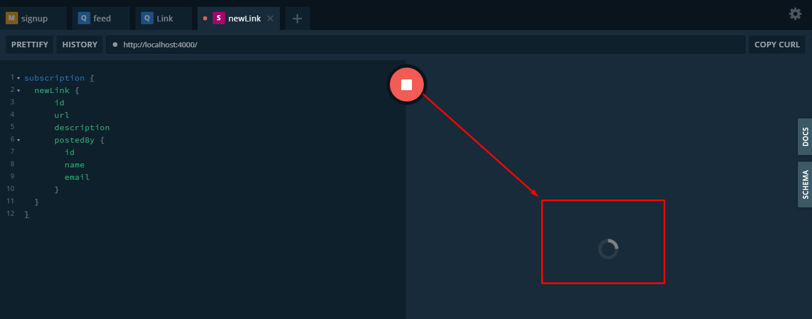
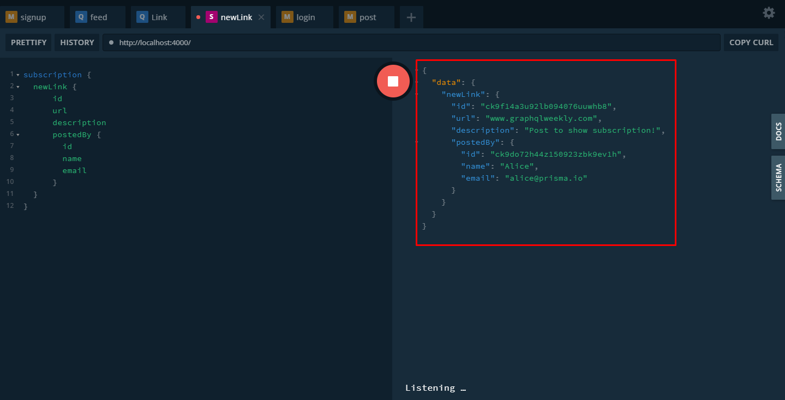

In the previous post we focused on how to add authentications to our server, we created a signup feature which provided a token we use to validate the user to post links. This time we need to add subscriptions, which are real time events whenever something occurs, like when a user logins, this is important especially for our client side with Apollo and React so the client can react accordingly.

## Subscribing new Link elements

Add this to your schema:

```javascript
type Subscription {
  newLink: Link
}
```

And for your resolver add a file called Subscription.js to your resolvers folder:

```javascript
function newLinkSubscribe(parent, args, context, info) {
  return context.prisma.$subscribe.link({ mutation_in: ['CREATED'] }).node()
}

const newLink = {
  subscribe: newLinkSubscribe,
  resolve: payload => {
    return payload
  },
}

module.exports = {
  newLink,
}
```

What this means is that when you create a link you proxie a subscription from the Prisma API. 

Now add it to the root index.js.

## Testing your subscription

Activate the server and open two different windows in your browser, one will act as a permanent websocket connection to the server, while the next one will send a post mutation to trigger the subscription.

Subscription:

```javascript
subscription {
  newLink {
      id
      url
      description
      postedBy {
        id
        name
        email
      }
  }
}
```

Putting this in your playground will look like this:



Which is waiting for an event to happen, which we will trigger with the following mutation, but before we need to be authenticated! So lets do it:

```javascript
mutation {
  login(
    email: "alice@prisma.io"
    password: "graphql"
  ) {
    token
    user {
      email
      links {
        url
        description
      }
    }
  }
}
```

With the token, add it to your HTTP headers and then make the post mutation:

```javascript
mutation {
  post(
    url: "www.graphqlweekly.com"
    description: "Post to show subscription"
  ) {
    id
  }
}
```

Which will give us this in our subscription:



Which gives us the data we just posted.

## Summary

- Add the subscription to your schema and resolver.
- If you want to listen to the creating of a Link for example which was our case, then add it on both files.
- In the schema add a newLink with the Link connected to it, while on your resolver you use that same newLink to add to the prisma client the capacity to listen to events.

## Conclusion

The objective of this post was to add a subscription event to our server, because our next goal is to make our client side be in sync to what we just did in the backend, so if you create a new user or if we login, we need to be able to listen to this event so the client can answer properly.

See you on the next post.

Sincerely,

**Eng Adrian Beria.**
