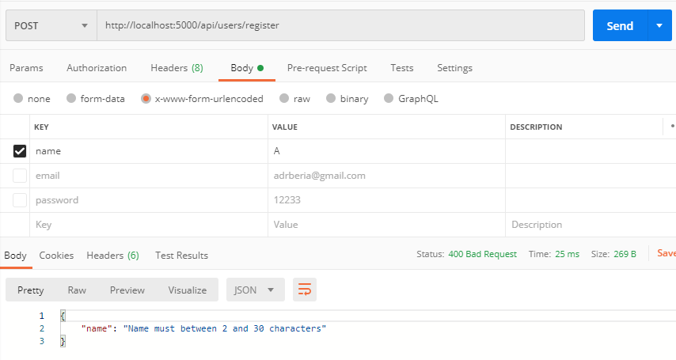

In this post we will continue with the next part of our application which is validation.

## Validating name

Inside validation/register.js

```javascript
const Validator = require('validator')
const isEmpty = require('./isEmpty')

module.exports = function validateRegisterInput(data) {
  let errors = {}

  if (!Validator.isLength(data.name, { min: 2, max: 30 })) {
    errors.name = 'Name must between 2 and 30 characters'
  }

  return {
    errors,
    isValid: isEmpty(errors),
  }
}
```

Inside validation/isEmpty.js

```javascript
const isEmpty = value =>
  value === undefined ||
  value === null ||
  (typeof value === 'object' && Object.keys(value).length === 0) ||
  (typeof value === 'string' && value.trim().length === 0)

module.exports = isEmpty
```

In routes/api/users change the following lines:

```javascript
// Load Input Validation
const validateRegisterInput = require('../../validation/register')

// @route  GET api/users/register
// @desc   Register user
// @access Public
router.post('/register', (req, res) => {
  const { errors, isValid } = validateRegisterInput(req.body)

  // Check Validation
  if (!isValid) {
    return res.status(400).json(errors)
  }

  User.findOne({ email: req.body.email }).then(user => {
    if (user) {
      errors.email = 'Email alredy exists'
      return res.status(400).json(errors)
    } else {
      const avatar = gravatar.url(req.body.email, {
        s: '200', // Size
        r: 'pg', // Rating
        d: 'mm', // Default
      })
      // new model Name
      const newUser = new User({
        name: req.body.name,
        email: req.body.email,
        avatar,
        password: req.body.password,
      })
      bcrypt.genSalt(10, (err, salt) => {
        bcrypt.hash(newUser.password, salt, (err, hash) => {
          if (err) throw err
          newUser.password = hash
          newUser
            .save()
            .then(user => res.json(user))
            .catch(err => console.log(err))
        })
      })
    }
  })
})
```

To test send a POST request to http://localhost:5000/api/users/register:



Our validation works!

## Validation for email and login

Inside validation/register.js

```javascript
const Validator = require('validator')
const isEmpty = require('./isEmpty')

module.exports = function validateRegisterInput(data) {
  let errors = {}

  data.name = !isEmpty(data.name) ? data.name : ''
  data.email = !isEmpty(data.email) ? data.email : ''
  data.password = !isEmpty(data.password) ? data.password : ''
  data.password2 = !isEmpty(data.password2) ? data.password2 : ''

  if (!Validator.isLength(data.name, { min: 2, max: 30 })) {
    errors.name = 'Name must between 2 and 30 characters'
  }

  if (Validator.isEmpty(data.name)) {
    errors.name = 'Name field is required'
  }

  if (Validator.isEmpty(data.email)) {
    errors.email = 'Email field is required'
  }

  if (!Validator.isEmail(data.email)) {
    errors.email = 'Email is invalid'
  }

  if (Validator.isEmpty(data.password)) {
    errors.password = 'Password field is required'
  }

  if (!Validator.isLength(data.password, { min: 6, max: 30 })) {
    errors.password = 'Password must be at least 6 characters'
  }

  if (Validator.isEmpty(data.password2)) {
    errors.password2 = 'Confirm Password field is required'
  }

  if (!Validator.equals(data.password, data.password2)) {
    errors.name = 'Passwords must match'
  }

  return {
    errors,
    isValid: isEmpty(errors),
  }
}
```

Now lets go for login:

```javascript
const Validator = require('validator')
const isEmpty = require('./isEmpty')

module.exports = function validateLoginInput(data) {
  let errors = {}

  data.email = !isEmpty(data.email) ? data.email : ''
  data.password = !isEmpty(data.password) ? data.password : ''

  if (!Validator.isEmail(data.email)) {
    errors.email = 'Email is invalid'
  }

  if (Validator.isEmpty(data.email)) {
    errors.email = 'Email field is required'
  }

  if (Validator.isEmpty(data.password)) {
    errors.password = 'Password field is required'
  }

  return {
    errors,
    isValid: isEmpty(errors),
  }
}
```

Import this inside users.js

```javascript
// Load Input Validation
const validateRegisterInput = require('../../validation/register')
const validateLoginInput = require('../../validation/login')

router.post('/login', (req, res) => {
  const email = req.body.email
  const password = req.body.password
  const { errors, isValid } = validateLoginInput(req.body)

  // Check Validation
  if (!isValid) {
    return res.status(400).json(errors)
  }

  // Find user by email
  User.findOne({ email }).then(user => {
    // Check for user
    if (!user) {
      errors.email = 'User not found'
      return res.status(404).json(errors)
    }

    // Check password
    bcrypt.compare(password, user.password).then(isMatch => {
      if (isMatch) {
        // User Matched
        const payload = {
          id: user.id,
          name: user.name,
          avatar: user.avatar,
        }

        // Sign Token
        // Takes a Payload, key
        // It expires after certain time
        jwt.sign(
          payload,
          keys.secretOrKey,
          {
            expiresIn: 3600,
          },
          (err, token) => {
            res.json({
              success: true,
              token: 'Bearer ' + token,
            })
          }
        )
      } else {
        errors.password = 'Password incorrect'
        return res.status(400).json(errors)
      }
    })
  })
})
```

Now lets check our POSTMAN to see if everything works correctly and in the right order of validation.

## Summary

- We did validations for name, email and passwords, we created two files called login and register inside validation, to make the logic for validating the respective information.
- For doing the logic we're using the library [validator](https://github.com/validatorjs/validator.js) which comes with several helpers to make it easier to validate the data we need.
- Then we import this inside our API for users and show if there is any error.

## Conclusion

For this part of the series we handled part of the validation logic using validator. It comes with several helpers similar to lodash which we can use to send information to the client when there is an error.

See you on the next post.

Sincerely,

**Eng Adrian Beria.**
