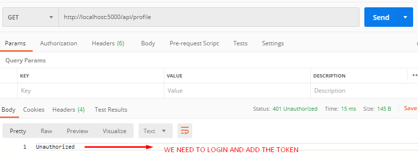
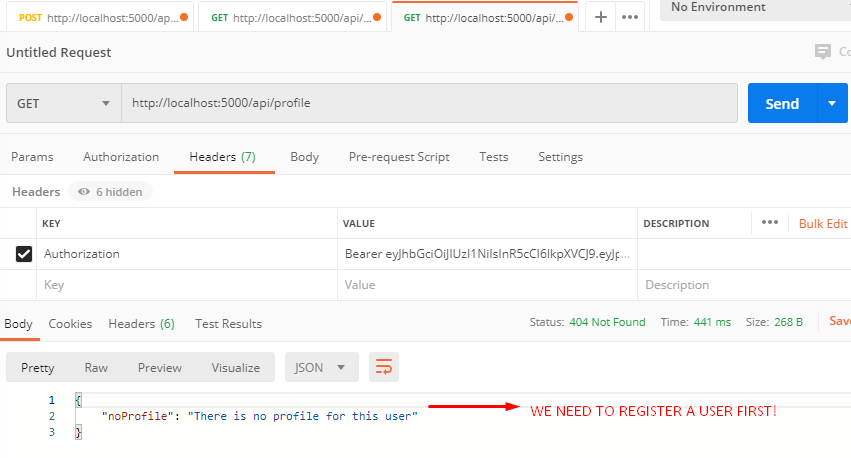
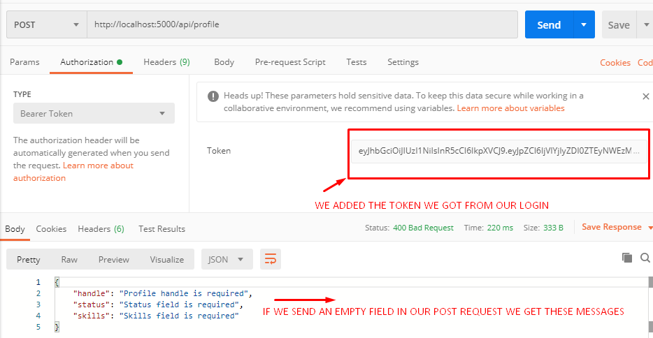
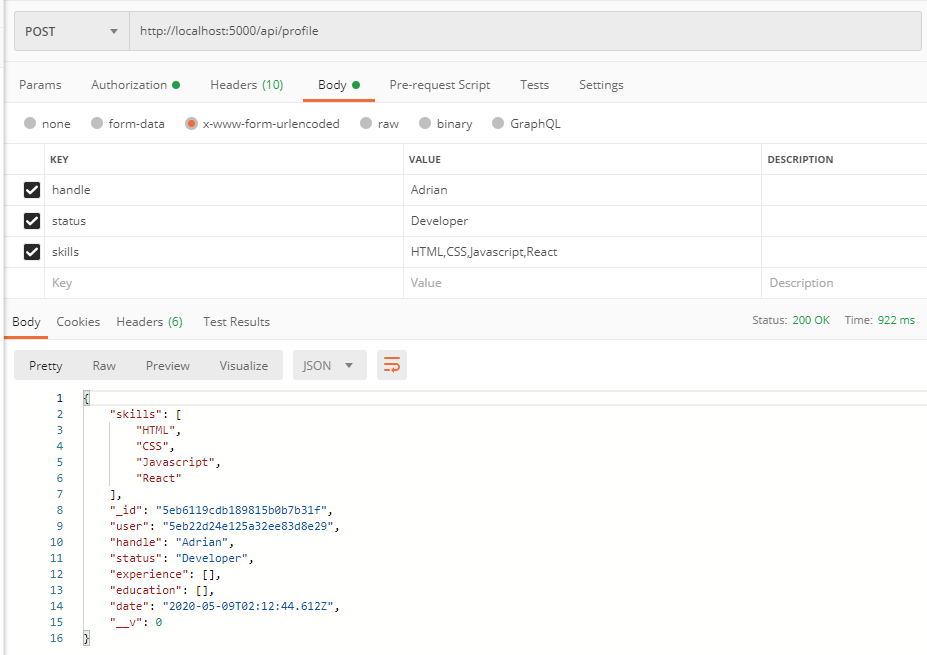
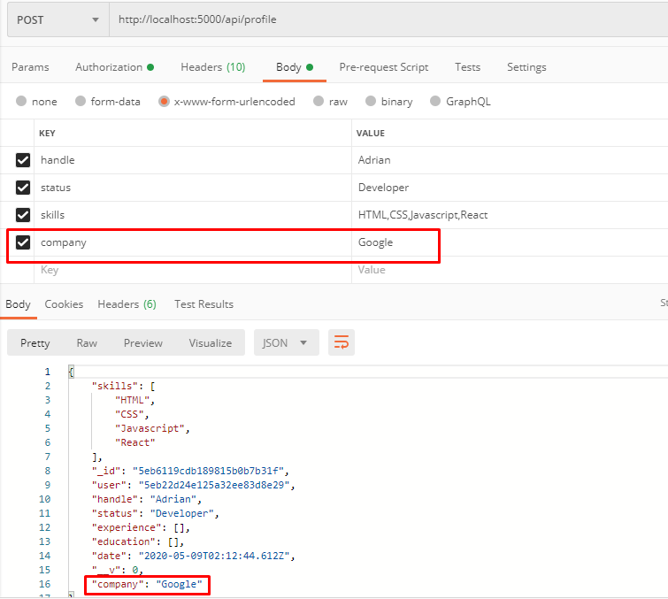
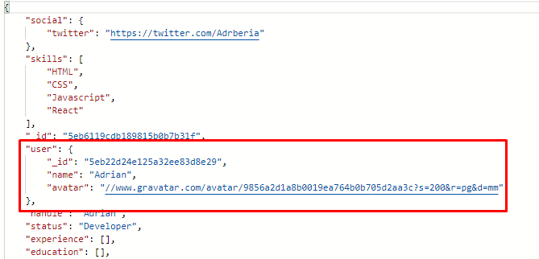

In this post we will

## Profiles Schema

```javascript
const mongoose = require("mongoose");
const Schema = mongoose.Schema;

// Create Schema
const ProfileSchema = new Schema({
  user: {
    // Associates user with id
    type: Sceham.Types.ObjectId,
    // This is our collection in DB
    ref: 'users'
  },
  handle: {
    type: String,
    required: true,
    max: 40
  },
  company: {
    type: String,
  },
  website: {
    type: String
  },
  location: {
    type: String
  },
  status: {
    type: String,
    required: true
  },
  skills: {
    type: [String],
    required: true
  },
  bio: {
    type: String,
  },
  githubUsername: {
    type: String
  },
  experience: [
    {
      title: {
        type: String,
        required: true
      },
      company: {
        type: String,
        required: true
      },
      location: {
        type: String
      },
      from: {
        type: Date,
        required: true
      },
      to: {
        type: Date
      },
      current: {
        type: Boolean,
        default: false
      },
      description: {
        type: String
      }
    },
    education: [
    {
      school: {
        type: String,
        required: true
      },
      degree: {
        type: String,
        required: true
      },
      fieldOfStudy: {
        type: String,
        required: true
      },
      from: {
        type: Date,
        required: true
      },
      to: {
        type: Date
      },
      current: {
        type: Boolean,
        default: false
      },
      description: {
        type: String
      }
    }
  ],
  social: {
    youtube: {
      type: String
    },
    twitter: {
      type: String
    },
    facebook: {
      type: String
    },
    instagram: {
      type: String
    },
    linkedin: {
      type: String
    }
  },
  date: {
    type: Date,
    default: Date.now
  }
})

module.exports = Profile = mongoose.model('profile', ProfileScehma)
```

Now we created our schema for Profiles!

## Profile Rute

```javascript
const express = require('express')
const router = express.Router()
const mongoose = require('mongoose')
const passport = require('passport')

// Load Profile Model
const Profile = require('../../models/Profile')
// Load User Model
const User = require('../../models/User')

// @route  GET api/profile/test
// @desc   Tests profile route
// @access Public
router.get('/tests', (req, res) =>
  res.json({
    msg: 'Profile works',
  })
)

// @route  GET api/profile
// @desc   Get current users profile
// @access Private
router.get(
  '/',
  passport.authenticate('jwt', { session: false }),
  (req, res) => {
    const errors = {}
    // The model alredy match with the ID
    Profile.findOne({ user: req.user.id })
      .then(profile => {
        if (!profile) {
          errors.noProfile = 'There is no profile for this user'
          return res.status(404).json(errors)
        }
        res.json(profile)
      })
      .catch(err => res.status(404).json(err))
  }
)

module.exports = router
```

If we test this it will only show 'There is no profile for this user', so we need to create one, to be able to do that we need to login, get the token and use it for the respective GET request, once we're logged in we can make a POST request to create out profile.

On the same file add:

```javascript
// @route  POST api/profile
// @desc   Create or Edit users profile
// @access Private
router.post(
  '/',
  passport.authenticate('jwt', { session: false }),
  (req, res) => {
    // Get fields
    const profileFields = {}
    profileFields.user = req.user.id
    if (req.body.handle) profileFields.handle = req.body.handle
    if (req.body.company) profileFields.company = req.body.company
    if (req.body.website) profileFields.website = req.body.website
    if (req.body.location) profileFields.location = req.body.location
    if (req.body.bio) profileFields.bio = req.body.bio
    if (req.body.status) profileFields.status = req.body.status
    if (req.body.githubUsername)
      profileFields.githubUsername = req.body.githubUsername

    // Skills - Split into array
    if (typeof req.body.skills !== 'undefined') {
      // Its CSV we need to split it into array
      profileFields.skills = req.body.skills.split(',')
    }

    // Social
    profileFields.social = {}
    if (req.body.youtube) profileFields.social.youtube = req.body.youtube
    if (req.body.facebook) profileFields.social.facebook = req.body.facebook
    if (req.body.twitter) profileFields.social.twitter = req.body.twitter
    if (req.body.instagram) profileFields.social.instagram = req.body.instagram
    if (req.body.linkedin) profileFields.social.linkedin = req.body.linkedin

    Profile.findOne({ user: req.user.id }).then(profile => {
      if (profile) {
        // UPDATE
        Profile.findOneAndUpdate(
          { user: req.user.id },
          { $set: profileFields },
          { new: true }
        ).then(profile => res.json(profile))
      } else {
        // Check if handle exists
        Profile.findOne({ handle: profileFields.handle }).then(profile => {
          if (profile) {
            errors.handle = 'That handle alredy exists'
            res.status(400).json(errors)
          }

          // Save Profile
          new Profile(profileFields).save().then(profile => res.json(profile))
        })
      }
    })
  }
)
```

Now that we created the route for the post request to API Profile, we need to test it, but before we need to add validations.

Inside validation/profiles.js:

```javascript
const Validator = require('validator')
const isEmpty = require('./isEmpty')

module.exports = function validateProfileInput(data) {
  let errors = {}

  data.handle = !isEmpty(data.handle) ? data.handle : ''
  data.status = !isEmpty(data.status) ? data.status : ''
  data.skills = !isEmpty(data.skills) ? data.skills : ''

  if (!Validator.isLength(data.handle, { min: 2, max: 40 })) {
    errors.handle = 'Handle needs to be between 2 and 40 characters'
  }

  if (Validator.isEmpty(data.handle)) {
    errors.handle = 'Profile handle is required'
  }

  if (Validator.isEmpty(data.status)) {
    errors.status = 'Status field is required'
  }

  if (Validator.isEmpty(data.skills)) {
    errors.skills = 'Skills field is required'
  }

  if (!isEmpty(data.website)) {
    if (!Validator.isURL(data.website)) {
      errors.website = 'Not a valid URL'
    }
  }

  if (!isEmpty(data.youtube)) {
    if (!Validator.isURL(data.youtube)) {
      errors.youtube = 'Not a valid URL'
    }
  }

  if (!isEmpty(data.twitter)) {
    if (!Validator.isURL(data.twitter)) {
      errors.twitter = 'Not a valid URL'
    }
  }

  if (!isEmpty(data.facebook)) {
    if (!Validator.isURL(data.facebook)) {
      errors.facebook = 'Not a valid URL'
    }
  }

  if (!isEmpty(data.linkedin)) {
    if (!Validator.isURL(data.linkedin)) {
      errors.linkedin = 'Not a valid URL'
    }
  }

  if (!isEmpty(data.instagram)) {
    if (!Validator.isURL(data.instagram)) {
      errors.instagram = 'Not a valid URL'
    }
  }

  return {
    errors,
    isValid: isEmpty(errors),
  }
}
```

Now lets return to our API Profile and add these validators to our post request:

```javascript
const { errors, isValid } = validateProfileInput(req.body)

// Check validation
if (!isValid) {
  // Return any errors with 400 status
  return res.status(400).json(errors)
}
```

Now lets go to POSTMAN to test our post request:



We obviously get an error because we haven't login yet, we need to add the token to properly access our information, so get the token and perform a GET request to 'api/profile':



This means we need to create a profile first!



Our validation is working! Now we need to add fields to the body, if you don't know who you're logged in as, you can go to **api/users/current**, then create the profile:



Notice the empty fields we haven't included because they're not required. But remember we can update our profile, so if send another POST request to this same URL we can add new fields:



Great! Now if we go to **api/profile** we get our updated profile.

One last thing we need to add is a user object from our "users" collection in the database, remember this line inside models/Profile

```javascript
user: {
    type: Schema.Types.ObjectId,
    ref: "users",
  },
```

This automatically adds the information from that collection into the Profile, but we need to put the respective line for it:

```javascript
Profile.findOne({ user: req.user.id }).populate('user', ['name', 'avatar'])
```

Now if we make a GET request to api/profile:



We get that the user key was populated using as reference in the schema, the database collection called "users" and we fetched the name and avatar into it.

## Get profile by id

Inside our same routes/api/profile file add:

```javascript
// @route  GET api/profile/all
// @desc   Get all profiles
// @access Public
router.get('/all', (req, res) => {
  const errors = {}
  Profile.find()
    .populate('user', ['name', 'avatar'])
    .then(profiles => {
      if (!profiles) {
        errors.noProfile = 'There are no profiles'
        return res.status(404).json(errors)
      }

      res.json(profiles)
    })
    .catch(err => res.status(404).json({ profile: 'There are no profiles' }))
})

// @route  GET api/profile/handle/:handle
// @desc   Get profile by handle
// @access Public
route.get('/handle/:handle', (req, res) => {
  const errors = {}
  // params is :handle, its whatever is on the url
  Profile.findOne({ handle: req.params.handle })
    .populate('user', ['name', 'avatar'])
    .then(profile => {
      if (!profile) {
        errors.noProfile = 'There is no profile for this user'
        rest.status(404).json(errors)
      }

      res.json(profile)
    })
    .catch(err => res.status(404).json(err))
})

// @route  GET api/profile/user/:user_id
// @desc   Get profile by user ID
// @access Public
route.get('/user/:user_id', (req, res) => {
  const errors = {}
  // params is :handle, its whatever is on the url
  Profile.findOne({ handle: req.params.user_id })
    .populate('user', ['name', 'avatar'])
    .then(profile => {
      if (!profile) {
        errors.noProfile = 'There is no profile for this user'
        rest.status(404).json(errors)
      }

      res.json(profile)
    })
    .catch(err =>
      res.status(404).json({ profile: 'There is no profile for this user' })
    )
})
```

Now test this going to api/profile/handle/:handle where in my case ":handle" was "Adrian", getting the profile we created before, now by handle. This is the public profile.

You can also check by ID, go to api/profile/user_id/:user_id where **:user_id** is obtained from the profile which is a bunch of random characters.

And you can check api/profile/all to obtain all the profiles as an array of objects.

## Summary

- We added the profiles endpoint, we have the private route where we can create/update and the public routes which can be accessed by anyone.
- For private routes we use passport adding the jwt option.
- In the model we used **type: Schema.Types.ObjectId** to populate inside our profile routes API, especifically to add the user element which comes directly from the database into the Profile collection making a relation between them.
- We worked on the validation of the inputs, handling the errors in a consistent way giving the respective HTTP status.

## Conclusion

For this part of the series we handled the Profiles for the user, both private and public routes, where one we can create or update a profile, and the other we can just read the information.

See you on the next post.

Sincerely,

**Eng Adrian Beria.**
