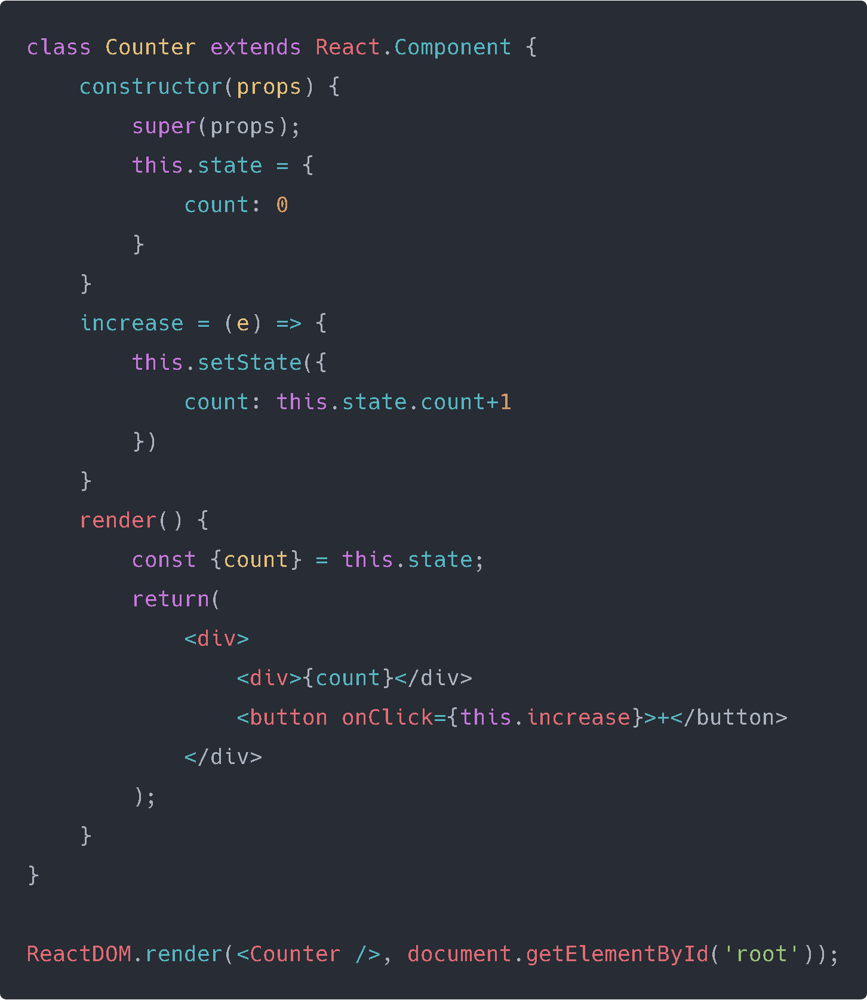
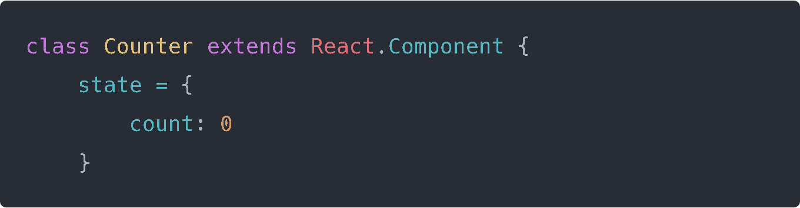

Its how React handles dynamic data in the DOM, any click event, form submission, must pass using states.

Whereas props are immutable and owned by a component’s parent, state is owned by the component. **this.state is private to the component** and as we’ll see can be updated with
this.setState(). 

When the state or props of a component update, the component will re-render itself.

## Lets work with a component with State!

We will make a simple counter, we press a "+" button in the UI to raise its value. We first need to plan how our state will look like.

We're seeing new stuff here.

- **[constructor(props)](https://developer.mozilla.org/en-US/docs/Web/JavaScript/Reference/Classes/constructor)**:   The **constructor** method is a special method for creating and initializing an object created within a class. 

	If you don’t initialize state and you don’t bind methods, you don’t need to implement a constructor for your React component. You can use a stateless function instead but don't worry, we will get more into that in later projects.

- **super(props)**: Will call the constructor of its parent class. This is required when you need to access some variables from the parent class. In **React**, when you call **super** with props. **React** will make props available across the component through this.props .

Lets make something clear, you don't need to use constructor and super even when defining a new class, you generally need them for using **props** and make it available inside the constructor, but if you don't need it then you can define the above code like this:

And the code will still work! Now lets get back to exploring the parts of the component.

- **increase**:  We defined it as an Arrow Function to bind **this**. The arrow function introduced in ES6 is a function with the current **‘this’** context already bound to the function. If we didn't do it this way, we would need the constructor but we Arrow Functions we don't need it.  So when we invoke this function we create a new state adding a +1 to the value it had before.

- **const {count} = this.state**:  Its an simpler way to say **this.state.count**, we can just say **count** and it would mean the same. 

## Conclusion

We learned more about **State**, as you can see its very simple to use and it makes controlling your Data more organized, you know what's happening and when. 

For the next post we will take on our first Project! We will stop using one HTML file and we will create our first App.

See you on the next post.

Sincerely,

**Eng. Adrian Beria.**