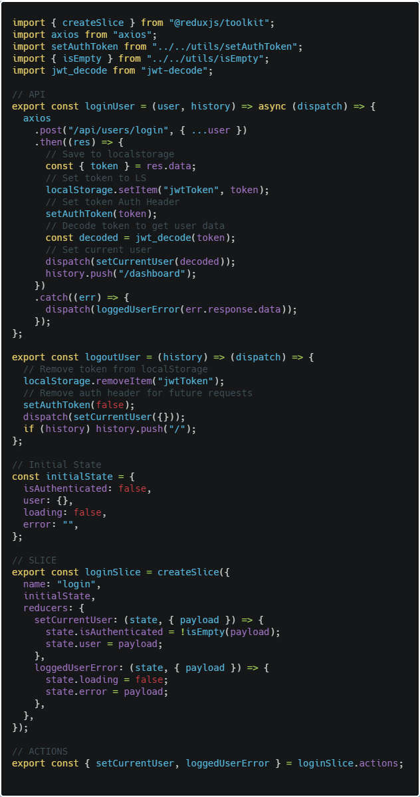

Now that we built our server we will go to develop our client with React, Bootstrap and Redux.

This is the link of the [project](https://github.com/Radinax/mern-social-network) we will be using to learn about this stack.

Here is the [fullsite](https://secret-ocean-02865.herokuapp.com/).

## Folder Structure

```bash
└── src
    |── components
    |   |── addCredentials
    |   |   |── AddEducation.js
    |   |   └── AddExperience.js
    |   |── auth
    |   |   |── Login.js
    |   |   └──Register.js
    |   |── common
    |   |   |── InputGroup.js
    |   |   |── PrivateRoute.js
    |   |   |── SelectListGroup.js
    |   |   |── Spinner.gif
    |   |   |── Spinner.js
    |   |   |── TextAreaFieldGroup.js
    |   |   └── TextFieldGroup.js
    |   |── createProfile
    |   |   └── CreateProfile.js
    |   |── dashboard
    |   |   |── Dashboard.js
    |   |   |── Education.js
    |   |   |── Experience.js
    |   |   └── ProfileActions.js
    |   |── editProfile
    |   |   |── EditProfile.js
    |   |   └── utils.js
    |   |── layout
    |   |   |── Footer.js
    |   |   |── Landing.js
    |   |   └── Navbar.js
    |   |── notFound
    |   |   └── NotFound.js
    |   |── posts
    |   |   |── PostFeed.js
    |   |   |── PostForm.js
    |   |   |── PostItem.js
    |   |   └── Posts.js
    |   |── profile
    |   |   |── Profile.js
    |   |   |── ProfileAbout.js
    |   |   |── ProfileCreds.js
    |   |   |── ProfileGithub.js
    |   |   └── ProfileHeader.js
    |   └── profiles
    |       |── ProfileItem.js
    |       └── Profiles.js
    ├── ducks
    |   |── slices
    |   |   |── loginSlice.js
    |   |   |── postSlice.js
    |   |   |── profileSlice.js
    |   |   └── registerSlice.js
    |   └── index.js
    ├── img
    ├── utils
    |   |── isEmpty.js
    |   |── lowerCase.js
    |   └── setAuthToken.js
    ├── App.css
    ├── App.js
    └── index.js
```

## Libraries

- bootstrap: Is the UI framework we will be using. Inside App.js we need to import bootstrap.css in order for it to work.

- @reduxjs/toolkit: It's the recomended way of using Redux in 2020. We focus on creating Slices which combines Reducers and Actions, reducing significantly the boilerplate.

- react-redux: We will be using Redux to handle state management and update our UI and express server at the same time.

- axios: Let us make HTTP requests.

- classnames: Let us manipulate css classes, since we're using pure Bootstrap we don't need to write any CSS except the one in App.css which is to normalize it.

- http-proxy-middleware: This is a library that helps us deploy our fullstack application to Heroku, adding another way of telling it that we're using localhost:5000 as the port to communicate.

- jwt-decode: This is needed due to the express server returning the token when we login, so we need to decode it to obtain the information we need, in this case the User login information which will be held inside the Redux state.

- moment: Along with react-moment, this library let us handle dates in a more elegant way.

## Thought Process on building the Client

In our server we created the following endpoints:

```bash
└── /api/users
              /register                         [POST]
              /login                            [POST]
              /current                          [GET]

└── /api/profile                                [GET] [POST] [DELETE]
              /all                              [GET]
              /handle/:handle                   [GET]
              /user/:user_id                    [GET]
              /experience                       [POST]
              /education                        [POST]
              /experience/:exp_id               [DELETE]
              /education/:edu_id                [DELETE]

└── /api/posts                                  [GET] [POST]
              /:post_id                         [GET] [DELETE]
              /like/:post_id                    [POST]
              /unlike/:post_id                  [POST]
              /comment/:post_id                 [POST]
              /comment/:post_id/:comment_id     [DELETE]
```

There are two routes, a public one where anyone can make a request to the respective endpoint using a program like Postman or making an HTTP request, then we have a private one where we need the user to login.

With those endpoints in mind let's go with a step by step summary on how we would tackle this application:

## REGISTER

We start by setting up our register component and functionality. For the UI we create a form:


Where it sends a post request to **/api/users/register** with the user information inside the Redux State, which uses @reduxjs/toolkit slices:


We use Redux Thunk for handling our async actions which we call inside our component and pass it the user information which is send to the endpoint, if we get an error like email not being valid, password too short or not equal to the confirm password field or the name alredy taken, then it sends an error as response which we catch and put it inside the state, which if it exists will update our UI.

In our server we receive this information and hash the password storing it in the DB.

## LOGIN

Using the information we used to register, we can login inside our application, inside our client we send a post request from the Login component, but first let's check our Redux Slice for this since it's quite different:



When we login we take the token we got as a response of the post request and put it inside the localstorage, then we use a utility function to add the token to the Authorization Headers for being able to use our private routes. We decode the token which contains the user information and we set it inside our Redux State and we send the user to the Dashboard component.

Inside our server when we send the request to login, we compare the passwords using bcrypt (remember the one we register is hashed) and then we use JWT to create the token using user information which is send as response.

## DASHBOARD

We create a Dashboard component which is the place we're sending the user after being logged in. We give the option to create a profile if they don't have one.

## Conclusion

The objective of this post is to start talking about the client we made in the MERN application, talking about the thought process of it and the decisions we made to document this in order to help us in future projects. Next post we will talk about the next step which are the Profiles.

See you on the next post.

Sincerely,

**Eng Adrian Beria.**
