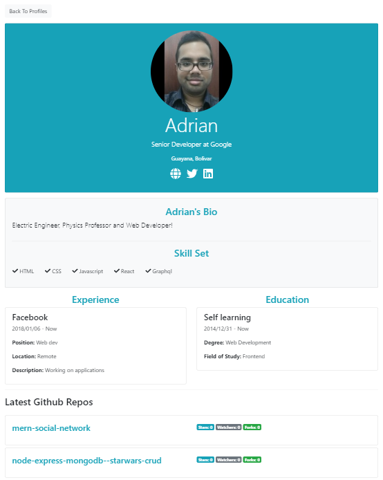

Now that we explored register-login flow into the Dashboard, let's check how to handle the profile.

This is the link of the [project](https://github.com/Radinax/mern-social-network) we will be using to learn about this stack.

Here is the [fullsite](https://secret-ocean-02865.herokuapp.com/).

## Folder Structure

```bash
└── src
    |── components
    |   |── addCredentials
    |   |   |── AddEducation.js
    |   |   └── AddExperience.js
    |   |── auth
    |   |   |── Login.js
    |   |   └──Register.js
    |   |── common
    |   |   |── InputGroup.js
    |   |   |── PrivateRoute.js
    |   |   |── SelectListGroup.js
    |   |   |── Spinner.gif
    |   |   |── Spinner.js
    |   |   |── TextAreaFieldGroup.js
    |   |   └── TextFieldGroup.js
    |   |── createProfile
    |   |   └── CreateProfile.js
    |   |── dashboard
    |   |   |── Dashboard.js
    |   |   |── Education.js
    |   |   |── Experience.js
    |   |   └── ProfileActions.js
    |   |── editProfile
    |   |   |── EditProfile.js
    |   |   └── utils.js
    |   |── layout
    |   |   |── Footer.js
    |   |   |── Landing.js
    |   |   └── Navbar.js
    |   |── notFound
    |   |   └── NotFound.js
    |   |── posts
    |   |   |── PostFeed.js
    |   |   |── PostForm.js
    |   |   |── PostItem.js
    |   |   └── Posts.js
    |   |── profile
    |   |   |── Profile.js
    |   |   |── ProfileAbout.js
    |   |   |── ProfileCreds.js
    |   |   |── ProfileGithub.js
    |   |   └── ProfileHeader.js
    |   └── profiles
    |       |── ProfileItem.js
    |       └── Profiles.js
    ├── ducks
    |   |── slices
    |   |   |── loginSlice.js
    |   |   |── postSlice.js
    |   |   |── profileSlice.js
    |   |   └── registerSlice.js
    |   └── index.js
    ├── img
    ├── utils
    |   |── isEmpty.js
    |   |── lowerCase.js
    |   └── setAuthToken.js
    ├── App.css
    ├── App.js
    └── index.js
```

## Endpoints

These are the endpoints for reference, we be using all the profile ones

```bash
└── /api/users
              /register                         [POST]
              /login                            [POST]
              /current                          [GET]

└── /api/profile                                [GET] [POST] [DELETE]
              /all                              [GET]
              /handle/:handle                   [GET]
              /user/:user_id                    [GET]
              /experience                       [POST]
              /education                        [POST]
              /experience/:exp_id               [DELETE]
              /education/:edu_id                [DELETE]

└── /api/posts                                  [GET] [POST]
              /:post_id                         [GET] [DELETE]
              /like/:post_id                    [POST]
              /unlike/:post_id                  [POST]
              /comment/:post_id                 [POST]
              /comment/:post_id/:comment_id     [DELETE]
```

## CREATE, READ, UPDATE AND DELETE PROFILE

If the user doesn't have a profile we show a message and give them the option to create one:


Now they're send into a form page:


This step is similar to the register, we created three reusable components in text, textarea and select inputs, we bring the redux async action to send the profile data and if we get an error we show it in the UI, once created we get redirected to the Dashboard.

User can also edit their profile and it will be mapped with the data he alredy has using a getCurrentProfile async action and then sending the information stored from the action and the user inputs.

User can also delete their profile, but **it deletes both the profile and the user**, which is why we need to send a warning message for the user. For delete we only need to send the request and the backend gets the user id and proceed to delete it from the database.

For the next step, any user can check all the profiles:


We simply make a get request and map the data into our Profiles component.

Finally there is the invidual profile:



On this case our url looks like **/profile/:handle**, so we can get the params using react-router-dom and send it using getProfileByHandle, we could've also use the user id to retrieve the information, either way would've been ok.

## EDUCATION AND EXPERIENCE

User can also add their education and experience on separate components and endpoints.


The process is similar, you add data into a form and then send it to the server, then you handle errors if there are any and you get redirected to the dashboard to add another education or experience.

You can also delete them with just one action, for each case you need to send their respective id which is generated in the database.

## FEED, POST, COMMENTS AND LIKES

Now that we explored all that we could in the dashboard section, we're going into the Feed. The idea is that a user can make a post and like/unlike and comment other posts.


So when a user makes a post it updates the database and the redux state, showing the change in real time, the user can delete its post and like/unlike it if he wants, but only once, otherwise they get an error.

## DEPLOY TO HEROKU

This was very tricky to handle, but let's go over it step by step:

1. Signup in the Heroku website.
2. Download the Heroku CLI or Toolbelt and install.
3. Open the terminal and write "**heroku**" to see if it works.
4. To do anything you need to login, "**heroku login**".
5. Next do "**heroku create**", to create a heroku application.
6. Go inside your dashboard in Heroku and add the keys for database, the **MONGO_URI** and **SECRET\_ OR_KEY**, that's inside your config files in your server.
7. Go into the deploy section and copy the link where it says "Existing Git Repository", paste it in your terminal while logged in.
8. Inside your package.json in the root folder of the server, add the following script: **"heroku-postbuild": "cd client && yarn install && yarn build"**.
9. Next inside your package.json in the **client**, install the "http-proxy-middleware" library, create a file inside src:

```javascript
const { createProxyMiddleware } = require('http-proxy-middleware')
module.exports = function(app) {
  app.use(
    '/api',
    createProxyMiddleware({
      target: 'http://localhost:5000',
      changeOrigin: true,
    })
  )
}
```

This helps Heroku to connect the client with the server.

Now for the next step, and this is important, in your terminal add the following command "heroku config:set YARN_PRODUCTION=false", this installs all your dev dependencies and you avoid the "INVALID POST HEADER" errors.

Finally it's time to deploy! First upload to github all your work and then inside the terminal with heroku logged in, write **git push heroku master** and we're done!

## Conclusion

The client side was more on the repetitive side, there were a LOT of components created for this social network application we created in a week, the idea was to go into the flow the user would experiment and go from there. For the lessons we learned:

- We got to handle tokens using JWT both in server and client.
- We used @reduxjs/toolkit in a medium sized application which we learned that we could declare a reducer to handle errors and loadings in general.
- We learned to use pure Boostrap without writing any extra CSS code.
- We were able to update both the global state and database providing real time changes in the UI for async actions.
- We were able to handle deployment with Heroku.

This was a great experience filled with plenty of learning!

See you on the next post.

Sincerely,

**Eng Adrian Beria.**
