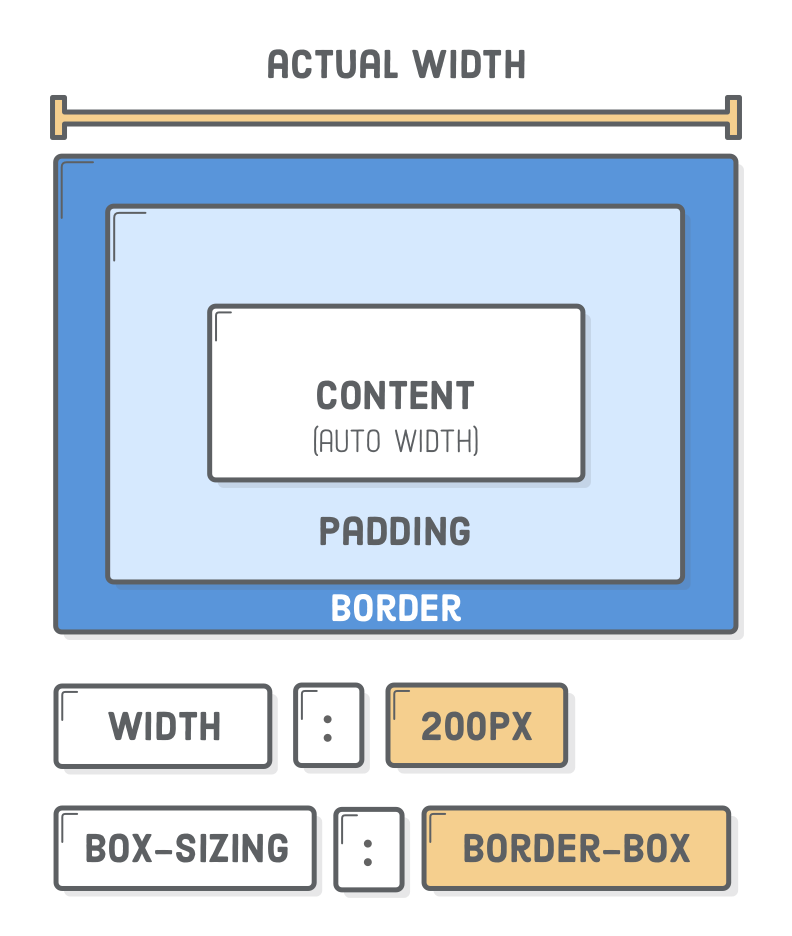

Today we're going to do something different but necesary, we're going to condense the most important and basics concepts of CSS.

## The Box Model

The “CSS box model“ is a set of rules that define how every web page on the Internet is rendered. CSS treats each element in your HTML document as a “box” with a bunch of different properties that determine where it appears on the page. So far, all of our web pages have just been a bunch of elements rendered one after another. The box model is our toolkit for customizing this default layout scheme.

Each HTML element rendered on the screen is a box, and they come in two flavors: “block” boxes and “inline“ boxes.


Let's see some properties of block boxes:

- Block boxes always appear below the previous block element. This is the “natural” or “static” flow of an HTML document when it gets rendered by a web browser.

- The width of block boxes is set automatically based on the width of its parent container. In this case, our blocks are always the width of the browser window.

- The default height of block boxes is based on the content it contains. When you narrow the browser window, the `<h1>` gets split over two lines, and its height adjusts accordingly.

- Inline boxes don’t affect vertical spacing. They’re not for determining layout—they’re for styling stuff inside of a block.

- The width of inline boxes is based on the content it contains, not the width of the parent element.

- When you set the left and right margin of a block-level element to auto, it will center the block in its parent element.

We can override the default box type of HTML elements with the CSS display property. For example, if we wanted to make our <em> and <strong> elements blocks instead of inline elements, we could update our rule

## Content, Padding, Border and Margin

The “CSS box model” is a set of rules that determine the dimensions of every element in a web page. It gives each box (both inline and block) four properties:

- Content – The text, image, or other media content in the element.
- Padding – The space between the box’s content and its border.
- Border – The line between the box’s padding and margin.
- Margin – The space between the box and surrounding boxes.


You can change the values of padding and margin in one line:

```css
p {
  padding: 20px 0 20px 10px; /* Top  Right  Bottom  Left */
}
```

You can do the same for border:

```css
h1 {
  padding: 50px;
  border: 1px solid #5d6063;
}
```

## Content and Border Boxes

Imagine trying to fill a 600px container with three boxes that are all width: 200px, but they don’t fit because they all have a 1px border (making their actual width 202px).


Fortunately, CSS lets you change how the width of a box is calculated via the box-sizing property. By default, it has a value of content-box, which leads to the behavior described above. Let’s see what happens when we change it to border-box:



This is much more intuitive, and as a result, using **border-box** for all your boxes is considered a best practice among modern web developers.

## Resetting Styles

Notice that white band around our page? That’s a default margin/padding added by your browser. Different browsers have different default styles for all of their HTML elements, making it difficult to create consistent stylesheets.


It’s usually a good idea to override default styles to a predictable value using the “universal” CSS selector (\*).

```css
* {
  margin: 0;
  padding: 0;
  box-sizing: border-box;
}
```

This selector matches every HTML element, effectively resetting the margin and padding properties for our web page. We also converted all our boxes to border-box, which, again, is a best practice.

## Conclusion

- Everything is a box.
- Boxes can be inline or block-level.
- Boxes have content, padding, borders, and margins.
- They also have seemingly arbitrary rules about how they interact.
- Mastering the CSS box model means you can lay out most web pages.

See you on the next post.

Sincerely,

**Eng Adrian Beria.**
