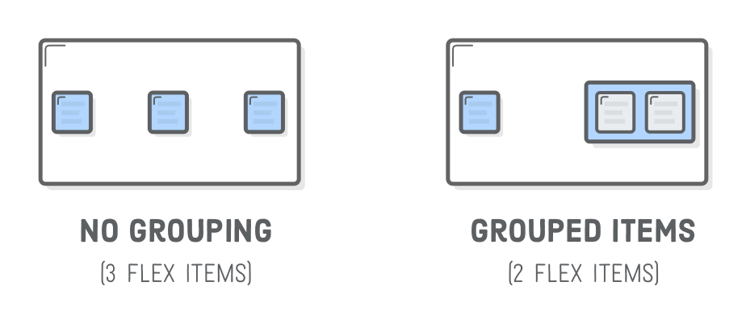
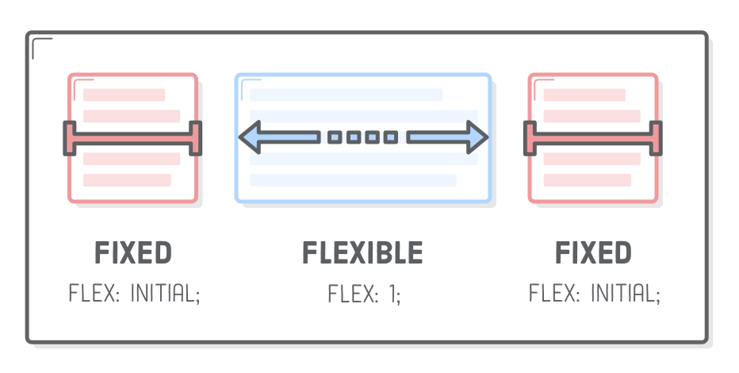

The “Flexible Box” or “Flexbox” layout mode offers an alternative to Floats for defining the overall appearance of a web page. Whereas floats only let us horizontally position our boxes, flexbox gives us complete control over the alignment, direction, order, and size of our boxes.

## Flexbox Overview

Flexbox uses two types of boxes: “flex containers” and “flex items”. The job of a flex container is to group a bunch of flex items together and define how they’re positioned.

Every HTML element that’s a direct child of a flex container is an **item**. Flex items can be manipulated individually, but for the most part, it’s up to the container to determine their layout. The main purpose of flex items are to let their container know how many things it needs to position.

## Justify Content

Define the horizontal alignment of its items:

You can also group flex items:

Remember that you need to add the **display: flex** property to the new div with the items inside to make them act as flex items.

## Vertical Alignment

Vertical alignment is defined by adding an align-items property to a flex container.

The available options for align-items is similar to justify-content:

- center
- flex-start (top)
- flex-end (bottom)
- stretch
- baseline

The box for each item extends the full height of the flex container, regardless of how much content it contains. A common use case for this behavior is creating equal-height columns with a variable amount of content in each one—something very difficult to do with floats.

## Wrapping Flex Items

## Flex Container Direction

When you rotate the direction of a container, you also rotate the direction of the justify-content property. It now refers to the container's vertical alignment, not its horizontal alignment.

## Flex Container Order

The flex-direction property also offers you control over the order in which items appear via the row-reverse and column-reverse properties.

## Flex Item Order

Adding an order property to a flex item defines its order in the container without affecting surrounding items. Its default value is 0, and increasing or decreasing it from there moves the item to the right or left, respectively.

## Flex Item Alignment

We can do the same thing with vertical alignment. What if we want that Subscribe link and those social icons to go at the bottom of the header instead of the center? Align them individually! This is where the align-self property comes in. Adding this to a flex item overrides the align-items value from its container:

- center
- flex-start (top)
- flex-end (bottom)
- stretch
- baseline

## Flexible Items

Flex items are flexible: they can shrink and stretch to match the width of their containers.

The flex property defines the width of individual items in a flex container. Or, more accurately, it allows them to have flexible widths. It works as a weight that tells the flex container how to distribute extra space to each item. For example, an item with a flex value of 2 will grow twice as fast as items with the default value of 1.

We can even mix-and-match flexible boxes with fixed-width ones. flex: initial falls back to the item’s explicit width property. This lets us combine static and flexible boxes in complex ways.

## Conclusion

- Use display: flex; to create a flex container.
- Use justify-content to define the horizontal alignment of items.
- Use align-items to define the vertical alignment of items.
- Use flex-direction if you need columns instead of rows.
- Use the row-reverse or column-reverse values to flip item order.
- Use order to customize the order of individual elements.
- Use align-self to vertically align individual items.
- Use flex to create flexible boxes that can stretch and shrink.

Remember that these flexbox properties are just a language that lets you tell browsers how to arrange a bunch of HTML elements. The hard part isn’t actually writing the HTML and CSS code, it’s figuring out, conceptually (on a piece of paper), the behavior of all the necessary boxes to create a given layout.

When a designer hands you a mockup to implement, your first task is to draw a bunch of boxes on it and determine how they’re supposed to stack, stretch, and shrink to achieve the desired design. Once you’ve got that done, it should be pretty easy to code it up using these new flexbox techniques.

The flexbox layout mode should be used for most of your web pages, but there are some things it’s not-so-good at, like gently tweaking element positions and preventing them from interacting with the rest of the page.

See you on the next post.

Sincerely,

**Eng Adrian Beria.**
