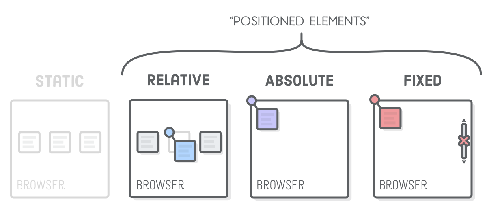
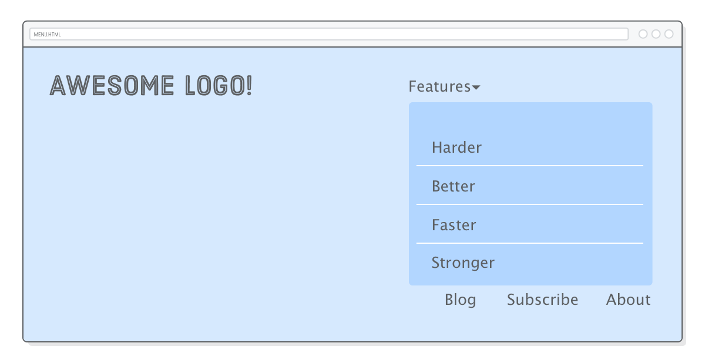

The “Flexible Box” or “Flexbox” layout mode offers an alternative to Floats for defining the overall appearance of a web page. Whereas floats only let us horizontally position our boxes, flexbox gives us complete control over the alignment, direction, order, and size of our boxes.


The other three types of positioning are “relative”, “absolute”, and “fixed”. Each of them let you manually position elements using specific coordinates, opposed to the more semantic options in flexbox and floats. Instead of saying “Stick this box in the center of its container,” advanced positioning lets you say things like “Put that box 20 pixels above and 50 pixels to the right of its parent’s origin.”

## Positioned Elements

The CSS position property lets you alter the positioning scheme of a particular element. Its default value, as you might imagine, is static. When an element’s position property doesn’t have a value of static, it’s called a “positioned element”. Positioned elements are what this entire section is about.



## Relative Positioning

“Relative positioning” moves elements around relative to where they would normally appear in the static flow of the page. This is useful for nudging boxes around when the default flow is just a little bit off.


The position: relative; line makes it a positioned element, and the top and left properties let you define how far it’s offset from its static position. This is sort of like setting an (x, y) coordinate for the element.


## Absolute Positioning

“Absolute positioning” is just like relative positioning, but the offset is relative to the entire browser window instead of the original position of the element. Since there’s no longer any relationship with the static flow of the page, consider this the most manual way to lay out an element.

The other interesting effect of absolute is that **it completely removes an element from the normal flow of the page**. So, why does absolute even exist?

## [Relatively] Absolute Positioning

Absolute positioning becomes much more practical when it’s relative to some other element that is in the static flow of the page. Fortunately, there’s a way to change the coordinate system of an absolutely positioned element.


Coordinates for absolute elements are always relative to the closest container that is a positioned element. It only falls back to being relative to the browser when none of its ancestors are positioned. So, if we change .item-absolute’s parent element to be relatively positioned, it should appear in the top-left corner **of that element instead of the browser window**.

## Fixed Positioning

“Fixed positioning” has a lot in common with absolute positioning: it’s very manual, the element is removed from the normal flow of the page, and the coordinate system is relative to the entire browser window. The key difference is that **fixed elements don’t scroll with the rest of the page**.


```css
.item-fixed {
  position: fixed;
  bottom: 0;
  right: 0;
}
```

This lets you create navigation bars that always stay on the screen, as well as those annoying pop-up banners that never go away.

## Creating a Menu using advanced positioning

We'll be making this menu:


Fixed positioning will let us make the menu stick to the top of the page, and relative positioning will give us an anchor for the absolutely positioned dropdown. We’ll also get a chance to talk about navigation menu best practices and see some practical applications of the pseudo-classes.

```html
<div class="header">
  <div class="logo"></div>
  <ul class="menu">
    <li class="dropdown"><span>Features ▾</span></li>
    <li><a href="#">Blog</a></li>
    <li><a href="#">Subscribe</a></li>
    <li><a href="#">About</a></li>
  </ul>
</div>
```

Navigation menus should almost always be marked up as a <ul> list instead of a bunch of <div> elements. These semantics make your site’s navigation much more accessible to search engines. Also notice how we’re preparing for our dropdown menu by adding a class attribute to the first <li> in the list. That <span> will allow us to differentiate the label from the submenu it reveals.

```css
* {
  margin: 0;
  padding: 0;
  box-sizing: border-box;
}

body {
  height: 1200px;
  font-size: 18px;
  font-family: sans-serif;
  color: #5d6063;
}

a:link,
a:visited {
  color: #5d6063;
  text-decoration: none;
}
a:hover {
  text-decoration: underline;
}

.header {
  position: fixed;
  display: flex;
  justify-content: space-between;

  width: 100%;
  padding: 50px;
  background: #d6e9fe;
}
```

These codes produce:


Despite being marked up as unordered lists, the navigation menus for most websites don’t actually look like a list. We can fix this by making the list items inline boxes instead of block boxes via the display property.

```css
.menu {
  margin-top: 15px;
}

.menu > li {
  display: inline;
  margin-right: 50px;
}

.menu > li:last-of-type {
  margin-right: 0;
}
```

We have to use child selectors here instead of descendant selectors because we only want to select <li> elements that are directly inside the .menu. This will become important once we add our submenu, which has its own <li> elements that we don’t want to style with this rule. This snippet also adds margins to all the list items, but removes it from the final <li> using the :last-of-type pseudo-class. This is a pretty common technique for creating margins between items.


Our submenu is going to look just like the top-level menu, except the whole thing will be nested inside a list item. Change the .menu element to match the following, ensuring that the entire .features-menu list is wrapped in the first <li> of the .menu element.

```html
<ul class="menu">
  <li class="dropdown">
    <span>Features &#9662;</span>
    <ul class="features-menu">
      <!-- Start of submenu -->
      <li><a href="#">Harder</a></li>
      <li><a href="#">Better</a></li>
      <li><a href="#">Faster</a></li>
      <li><a href="#">Stronger</a></li>
    </ul>
    <!-- End of submenu -->
  </li>
  <li><a href="#">Blog</a></li>
  <!-- These are the same -->
  <li><a href="#">Subscribe</a></li>
  <li><a href="#">About</a></li>
</ul>
```

This provides a lot of crucial information for search engines. **It allows Google to see that all these new items are associated with the Features label and that they form an isolated section of our website**. You should always mark up complex navigation menus with this kind of structure.

As for the CSS, we’ll deal with the interactive dropdown part later. Right now, let’s just get our submenu looking the way we want it to. Add some simple styles so we can see the box we’re trying to position:

```css
.features-menu {
  display: flex;
  flex-direction: column;
  background: #b2d6ff;
  border-radius: 5px;
  padding-top: 60px;
}

.features-menu li {
  list-style: none;
  border-bottom: 1px solid #fff;

  padding: 0 40px 10px 20px;
  margin: 10px;
}

.features-menu li:last-of-type {
  border-bottom: none;
}
```

The submenu itself is styled correctly, but it’s showing up in the wrong place and severely messing up the rest of our top-level menu items. This should be expected because it’s still statically positioned, which means it still interacts with its parent and surrounding elements.



We want our other top-level menu items to display just like they did before we added the submenu, as if the submenu wasn’t even there. Wait a second…that’s the exact behavior of absolutely positioned elements. Let’s give it a shot. Add a few lines to the .features-menu rule:

```css
.features-menu {
  display: flex;
  flex-direction: column;
  background: #b2d6ff;
  border-radius: 5px;
  padding-top: 60px;

  position: absolute; /* Add these */
  top: -25px;
  left: -30px;
}
```

Great! The submenu is no longer part of the static flow of the page, so our top-level menu items are back to normal. However, the submenu should appear underneath the Features label—not in the corner of the browser window. What a coincidence…we just learned how do that!

The submenu resides in <li class='dropdown'>. Turning that into a positioned element should change the coordinate system used by our absolutely positioned .features-menu:

```css
.dropdown {
  position: relative;
}
```

Ok, next problem. Our submenu is in the right spot, but now it’s covering up the Features label.

The z-index property lets you control the depth of elements on the page. If you think of your screen as 3D space, negative z-index values go farther into the page, and positive ones come out of the page.


In other words, the .features-menu element needs to have a lower z-index than the Features label. The default z-index value is 0, so let’s make both of them higher than that. We conveniently wrapped the Features label in a <span>, allowing us to style it via a child selector, like so:

```css
.dropdown > span {
  z-index: 2;
  position: relative; /* This is important! */
  cursor: pointer;
}

.features-menu {
  /* ... */
  z-index: 1;
}
```

The Features label should now appear on top of the submenu. Take note of that position: relative; line. It’s required because only positioned elements pay attention to their z-index property. This is easy to forget, so make a mental note for the next time you’re having depth issues and your CSS rules don’t seem to have any effect.


Alright! Submenu done! Our final task is to hide it until the user hovers over it. Remember that :hover pseudo-class from the CSS Selectors chapter? We can use that to turn our submenu into an interactive dropdown.

First, we need to change our existing .features-menu rule to only show the submenu when the user hovers over it by adding a :hover descendant selector. Update the .features-menu selector to match the following:

```css
.dropdown:hover .features-menu {
  /* This used to be `.features-menu` */
  display: flex; /* Leave everything else alone */
  flex-direction: column;
  background: #b2d6ff;
  /* ... */
}
```

Then, we need to initially hide the submenu using the display property. Add a new rule to menu.css:

```css
.features-menu {
  /* Add this as a new rule */
  display: none;
}
```

Setting display to none makes an element completely disappear. By overriding that value with flex in the :hover rule, we’re effectively telling the browser to show the .features-menu again. This clever combination of descendant selectors and pseudo-classes enables us to conditionally hide or show an element.

## Conclusion

In this chapter, we took a look at four new CSS layout schemes:

- Relative
- Absolute
- Relatively absolute
- Fixed

Relative positioning was for tweaking the position of an element without affecting its surrounding boxes. Absolute positioning took elements out of the static flow of the page and placed them relative to the browser window, while relatively absolute positioning allowed us to hook back into the static flow of the page. Finally, fixed positioning let us make elements that didn't scroll with the rest of the page.

See you on the next post.

Sincerely,

**Eng Adrian Beria.**
