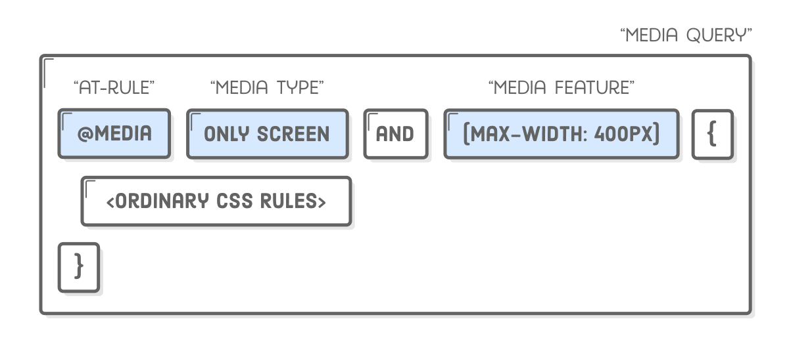
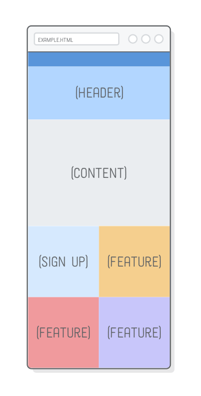

Responsive design is accomplished through CSS “media queries”. Think of media queries as a way to conditionally apply CSS rules. They tell the browser that it should ignore or apply certain rules depending on the user’s device.

## CSS Media Queries

We’ll start small by simply updating the background color on the <body> element based on the device width. This is a good way to make sure our media queries are actually working before getting into complicated layouts.


Let’s differentiate between narrow, medium, and wide layouts by creating a new styles.css stylesheet and adding the following:

```css
* {
  margin: 0;
  padding: 0;
  box-sizing: border-box;
}

/* Mobile Styles */
@media only screen and (max-width: 400px) {
  body {
    background-color: #f09a9d; /* Red */
  }
}

/* Tablet Styles */
@media only screen and (min-width: 401px) and (max-width: 960px) {
  body {
    background-color: #f5cf8e; /* Yellow */
  }
}

/* Desktop Styles */
@media only screen and (min-width: 961px) {
  body {
    background-color: #b2d6ff; /* Blue */
  }
}
```

When you resize your browser, you should see three different background colors: blue when it’s greater than 960px wide, yellow when it’s between 401px and 960px, and red when it’s less than 400px.

Media queries always begin with the @media “at-rule” followed by some kind of conditional statement, and then some curly braces. Inside the curly braces, you put a bunch of ordinary CSS rules. The browser only pays attention to those rules if the condition is met.



The only screen “media type” means that the contained styles should only be applied to devices with screens (opposed to printed documents, like when you hit Cmd+P in a browser). The min-width and max-width parts are called “media features”, and they specify the device dimensions you’re targeting.

The above media queries are by far the most common ones you’ll encounter, but there are a lot of [other conditions](https://developer.mozilla.org/en-US/docs/Web/CSS/@media) you can check for, including whether the device is in portrait or landscape mode, the resolution of its screen, and whether it has a mouse or not.

## A few notes

Ok, so @media is how we define different layouts for specific device widths, but what layouts are we actually trying to implement? The example web page for this chapter is going to look something like this:


There’s a few [well defined patterns](https://developers.google.com/web/fundamentals/design-and-ui/responsive/patterns/?hl=en) for how a desktop layout collapses into a mobile layout (we’re using “layout shifter”). There are two concepts that you must understand as a developer:

- A “fluid” layout is one that stretches and shrinks to fill the width of the screen, just like the flexible boxes we covered a few chapters ago.
- A “fixed-width” layout is the opposite: it has the same width regardless of the screen dimensions (we created one of these in the CSS Selectors chapter).


In our example web page, the mobile and tablet versions are fluid, and the desktop version is fixed-width.

### Choosing breakpoints

Most of those responsive design patterns have similar behavior, using fluid layouts for mobile/tablet devices and fixed-width layouts for wider screens. There’s a reason for this.

Fluid layouts let us target a range of screen widths instead of specific mobile devices. This is very important for web designers. When they set out to create a mobile layout, they aren’t trying to make something that looks good on an iPhone 6s, Galaxy S7, or iPad mini—they’re designing a fluid layout that looks good anywhere between 300 pixels and 500 pixels (or whatever).

In other words, the exact pixel values for the min-width and max-width parameters in a media query (collectively known as the “breakpoints” for a responsive website) don’t actually matter. Our website doesn’t care about the specific device the user is on. All it needs to know is that it should display a layout that looks pretty at 400 pixels wide (or whatever).

## Mobile First Development

It’s always a good idea to start with the mobile layout and work your way up to the desktop version. Desktop layouts are typically more complex than their mobile counterparts, and **this “mobile-first” approach maximizes the amount of CSS that you can reuse across your layouts**.

First, we need to fill in responsive.html’s <body> element with some empty boxes. Each box has an image in it so we can tell them apart a little bit easier.

```html
<div class="page">
  <div class="section menu"></div>
  <div class="section header"></div>
  <div class="section content"></div>
  <div class="section sign-up"></div>
  <div class="section feature-1"></div>
  <div class="section feature-2"></div>
  <div class="section feature-3"></div>
</div>
```

And here’s our base styles, which should apply to all layouts (mobile, tablet, and desktop). Make sure to add these above the @media rules we created earlier and below the [universal selector](https://www.internetingishard.com/html-and-css/css-box-model/#resetting-styles) rule that resets our margins and padding:

```css
.page {
  display: flex;
  flex-wrap: wrap;
}

.section {
  width: 100%;
  height: 300px;
  display: flex;
  justify-content: center;
  align-items: center;
}

.menu {
  background-color: #5995da;
  height: 80px;
}

.header {
  background-color: #b2d6ff;
}

.content {
  background-color: #eaedf0;
  height: 600px;
}

.sign-up {
  background-color: #d6e9fe;
}

.feature-1 {
  background-color: #f5cf8e;
}

.feature-2 {
  background-color: #f09a9d;
}

.feature-3 {
  background-color: #c8c6fa;
}
```

If you make the browser window narrow, you'll see that this gives us our entire mobile layout. Pretty easy, huh? No media queries required. That’s why it’s called “mobile-first”—the mobile version doesn’t require any special handling. Also notice that flex-wrap property in the containing .page div. This will make it very easy to implement our tablet and desktop layouts.


By keeping these base styles outside of the media queries, we’re able to override and add on to them as we implement our specific layouts. This is really convenient when, for instance, your designer wants to tweak the color scheme for the entire website. Instead of tracking down redundant background-color declarations in several @media rules, you only have to update it here. That change automatically applies to the mobile, tablet, and desktop layouts.

### Tablet Layout

On to the tablet layout. The only difference between the mobile and tablet mockups is that the Sign Up and Feature sections form a 2×2 grid instead of a single column.

Flexbox makes this real easy. Simply adjust the widths of the flex items to be half the screen and flex-wrap will take care of the rest. Of course, we only want this behavior to apply to tablet-sized screens, so it needs to go into an @media rule. Replace the existing /_ Tablet Styles _/ media query with the following:

```css
/* Tablet Styles */
@media only screen and (min-width: 401px) and (max-width: 960px) {
  .sign-up,
  .feature-1,
  .feature-2,
  .feature-3 {
    width: 50%;
  }
}
```

To see these changes, make sure your browser window is between 400 pixels and 960 pixels wide, then scroll down to the bottom of the page. You should see a colorful grid:



Again, it doesn’t matter what the exact width of the screen is: this layout will fluidly respond to any width in the media query’s range. Our mobile layout is also fluid, so we now have a website that looks beautiful (if a bit empty) in every device smaller than 960px wide.

### Desktop Layout

And that’s where our desktop layout comes in. We don’t want our web page to expand endlessly, so we’re going to give it a fixed width and center it with auto-margins. As with tablet styles, this needs to go into a media query. Replace the existing /_ Desktop Styles _/ media query with the following:

```css
/* Desktop Styles */
@media only screen and (min-width: 961px) {
  .page {
    width: 960px;
    margin: 0 auto;
  }
  .feature-1,
  .feature-2,
  .feature-3 {
    width: 33.3%;
  }
  .header {
    height: 400px;
  }
}
```

This gives us the correct widths for everything, and we have more real estate to play with, so we made the header a little taller, too. Almost there, but our desktop layout calls for some reordering: the Sign Up and Content boxes should appear underneath all the Feature sections.


This is where flexbox really shines. Trying to create this combination of mobile and desktop layouts would be very difficult with floats. With flexbox’s order property, it’s just a few lines of CSS. Append these rules to the desktop media query:

```css
.sign-up {
  height: 200px;
  order: 1;
}
.content {
  order: 2;
}
```

Ta da! A responsive website! Not bad for less than a hundred lines of CSS. More importantly, we didn’t have to alter a single line of HTML to accommodate our mobile, tablet, and desktop layouts.

This was just one example of laying out a responsive site. You can use these exact same techniques to implement all sorts of other designs. Start with the base styles that apply to your entire site, then tweak them for various device widths by selectively applying CSS rules with @media. You could even add another media query to, say, create a dedicated layout for ultra-widescreen monitors.

## Disabling Viewport Zooming

Before responsive design was a thing, mobile devices only had a desktop layout to work with. To cope with this, they zoomed out to fit the entire desktop layout into the width of the screen, letting the user interact with it by zooming in when necessary.


This default behavior will prevent mobile devices from using our mobile layout, which is obviously very terrible. To disable it, add the following element to the <head> of our document. Just like <meta charset='UTF-8'/>, this is a critical element that should be on every single web page you create:

```html
<meta
  name="viewport"
  content="width=device-width, initial-scale=1.0, maximum-scale=1.0"
/>
```

## Conclusion

Believe it or not, that’s actually all you need to know to create responsive websites. If we boil it down, we’re really only concerned with three things:

- The responsive design (the mockups for each layout)
- CSS rules for implementing each of those layouts
- Media queries for conditionally applying those CSS rules

We started this chapter by learning about the difference between fluid layouts and fixed-width layouts. Then, we went on to create a mobile-first stylesheet that used media queries to build tablet and desktop layouts on top of a shared set of base styles. Finally, we disabled the default viewport zoom behavior of mobile browsers.

So, that was the easy part of responsive design. In the next chapter, we’ll discover the hard part: images. Presenting different CSS to specific devices isn’t too bad, but optimizing images for those devices requires a bit more planning.

See you on the next post.

Sincerely,

**Eng Adrian Beria.**
