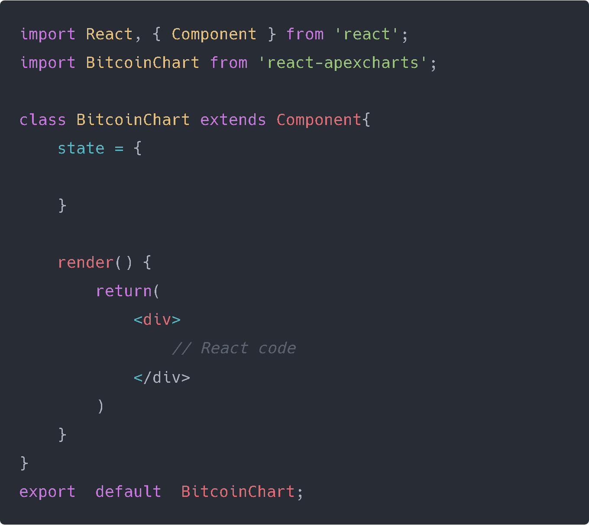
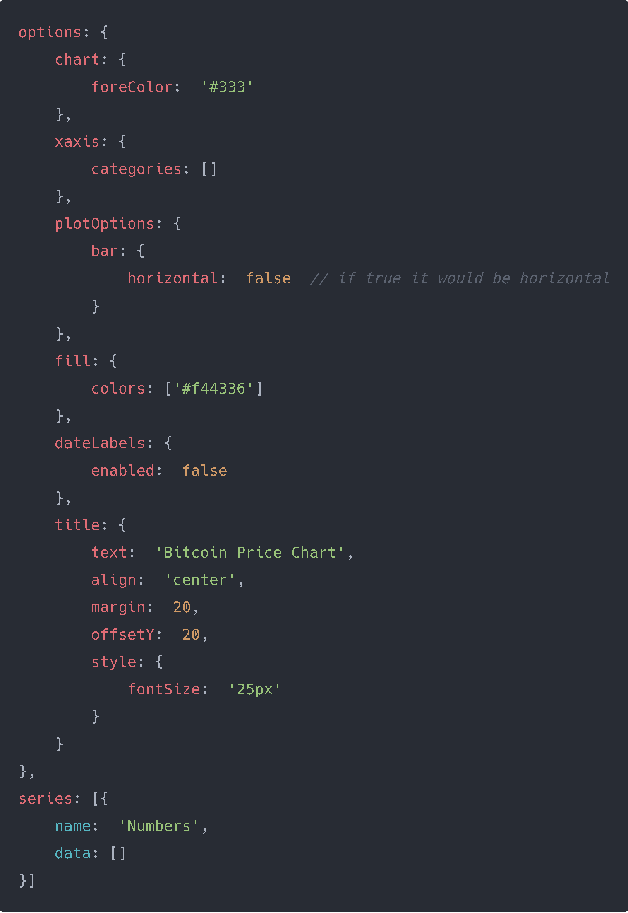
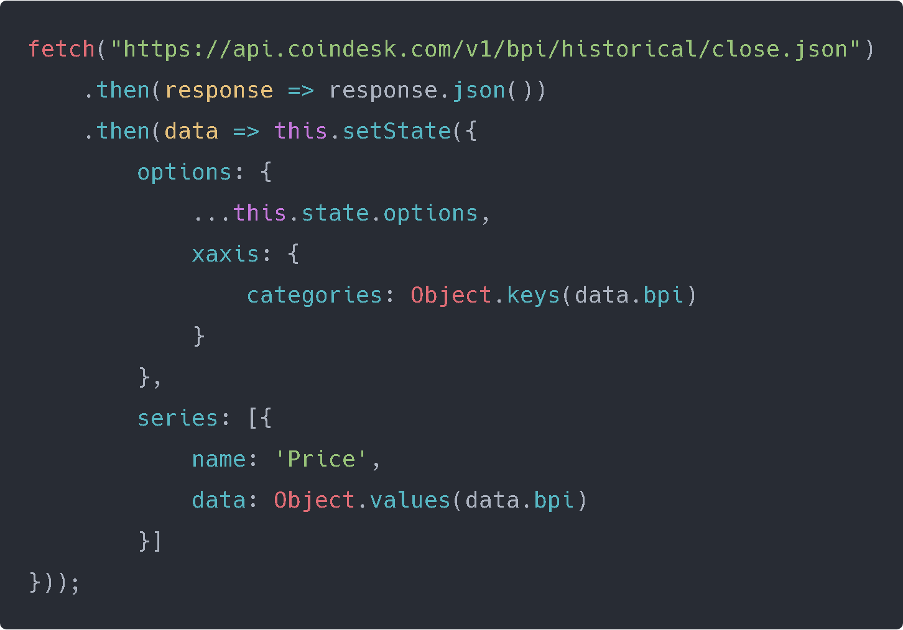
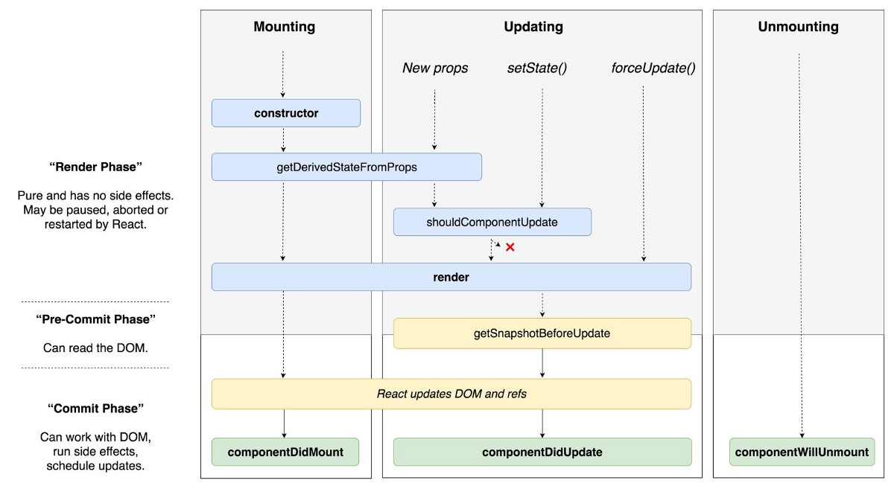
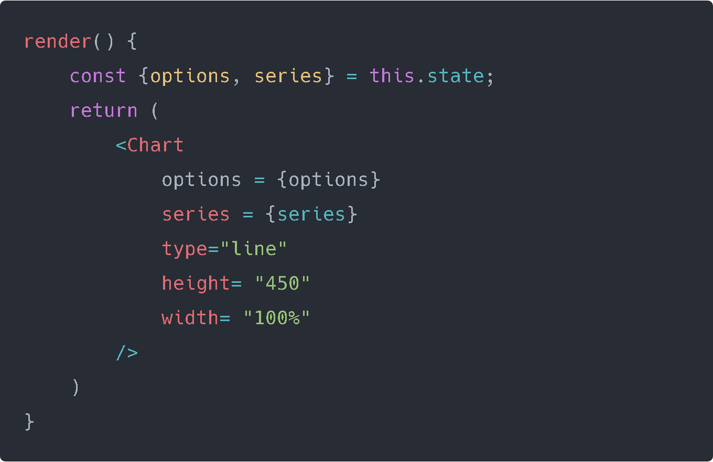

## What we will make?

A simple [Bitcoin Chart application](http://knowledgeable-boat.surge.sh/) where we can check its latest values.

To make it we will use [Apex Charts](https://apexcharts.com/) which is a charting library which will help us graph our data. Follow the instructions in the documentation which are pretty simple.

We used a single HTML file to code our React component, but now we will use a great tool given by React which is called [create-react-app](https://github.com/facebook/create-react-app).

I use [VS Code](https://code.visualstudio.com/) for writing code since it comes with helpful plugins, but that's out of the scope of this article.

First create a Projects Folder and open your terminal (you can use Windows CMD or Gitbash) and write the following command:

    npx create-react-app Bitcoin-Chart
    cd Bitcoin-Chart
    npm start

We will get a cool playground in http://localhost:3000.

Now in our terminal write "**code .**" to open our code editor and we will see the following setup:

```
my-app
├── README.md
├── node_modules
├── package.json
├── .gitignore
├── public
│   ├── favicon.ico
│   ├── index.html
│   └── manifest.json
└── src
    ├── App.css
    ├── App.js
    ├── App.test.js
    ├── index.css
    ├── index.js
    ├── logo.svg
    └── serviceWorker.js
```
- **README**: Is a markdown file which is where we write the basics of our app, as developers its important that someone can read this section and understand what your app is doing.
- **Node Modules**: Its where we will store our modules which you can consider as Javascript Libraries.
- **[Package.json](https://docs.npmjs.com/files/package.json)**: This file holds various metadata relevant to the project. This file is used to give information to npm that allows it to identify the project as well as handle the project's dependencies.
- **.gitignore**: Its files we generally ignore when uploading our project in github, we don't want to upload ALL our node modules into our github, with the Package.json we can do **npm install** and we can have our dependencies back.
- **Public Folder**: It has our HTML file and 
	- **manifest.json**: Which provides information about an application (such as name, author, icon, and description) in a **JSON** text **file**. The purpose of the **manifest** is to install web applications to the homescreen of a device, providing users with quicker access and a richer experience.
- **src folder**: Its where our React code will be.
	- **Index.js**: Its where our ReactDOM.render will be and it will render our App.js component.
	- **App.js**: Its where will put all our components.
	- **serviceWorker.js:** The **service worker code** basically registers a service worker for the React app. We first check if the app is being served from localhost via the `isLocalhost` const value that will either return a truthy or falsy value. The `register()` function helps to register the service worker to the React app only if its in a production mode and if the browser supports Service workers.

The rest of the files aren't important. We will work on **tests** in later posts.

Now erase every file inside src folder except those two files mentioned above.

## Lets build our app!

Create a Components folder inside the src folder and inside create a **Chart.js** file and inside that file we will have the following code:



According to the [documentation](https://apexcharts.com/docs/react-charts/) we need to define our state with the following object:



So our data that will be in the x-axis will be an object with the array **categories** inside, you can use the name you want, while the y-axis data will be inside the data key as an array.
    
Now how will we get the Bitcoin value? We will use

## Fetch API

Which is a simple interface for **fetching** resources. **Fetch** makes it easier to make web requests and handle responses than with the older XMLHttpRequest,**which** often requires additional logic (for example, for handling redirects).

First of all our Bitcoin data will be obtained from **coindesk api** using the url "https://api.coindesk.com/v1/bpi/historical/close.json" where if you open it you can see a json file inside the link, use a JSON viewer extension.

In that link we see an object with the format like this:

    bpi:  {
    	date: value
    }

Fetch API is based on [Promises](https://developer.mozilla.org/es/docs/Web/JavaScript/Referencia/Objetos_globales/Promise) which do something and when its done it does another. In our context it will look like this:



This is read as fetching an external data from the url, when we get it then we turn it into **json**, then we take that data and fill up our state.

You will notice "**...this.state.options**", this is called [spread operator](https://developer.mozilla.org/en-US/docs/Web/JavaScript/Reference/Operators/Spread_syntax) and what it does is copy everything inside the **options** except **xaxis** which will be equal to an array with the date **key**.

We're using **Object.keys** which creates an array filled with every key inside the object. As you could guess we did the same for the **yaxis** but we used **Object.values**.

## Life Cycle Methods

So where do we put our Fetch API? React has what is called [Life Cycle Methods](https://reactjs.org/docs/state-and-lifecycle.html):



In our case we want to fetch the data when the component is mounted. So inside our class we will put:

    componentDidMount() {
	    fetch(...)
    }

And finally from the documentation we need to add the state data into the props of the Chart component along some other data to configure our Graphic:



And now we have our code ready! We can check the tragic fall of Bitcoin at the date of this article!

You can check [here](https://github.com/Radinax/React-Bitcoin-Chart) and for the demo check [here](http://knowledgeable-boat.surge.sh/).

## Conclusion

We learned how to use Fetch API and use the data to setup our initial state with modern Javascript, we also used a Life Cycle Hook such as **componentDidMount** (you're going to use it a lot).

For our next post we will be making a website and setting up our router and working with styling our site.

See you on the next post.

Sincerely,

**Eng Adrian Beria.**