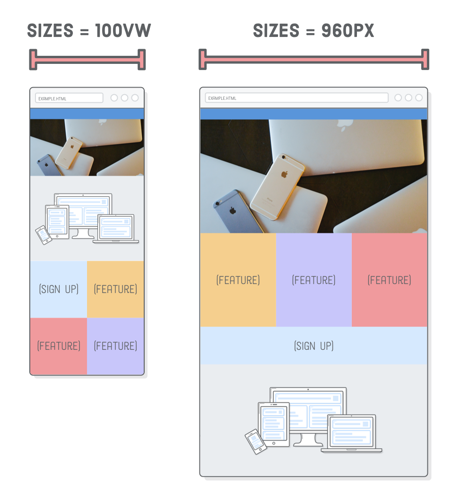

In Responsive Design, we learned how to use media queries to create separate mobile, tablet, and desktop layouts. Now, we’re going to add images to the mix. Just as media queries let us conditionally present different CSS rules, we want to display different images based on the user’s device.


The problem is, images have inherent dimensions. We can’t stretch a photo that’s 500×250 pixels to anything beyond 500 pixels wide because it’ll get pixelated. Retina displays and mobile devices complicate things even more. To make our images responsive, we now have to take three things into consideration:

- The device’s dimensions
- The image’s dimensions
- The device’s screen resolution

This will be more difficult than media queries, which were only concerned with device width. But don’t worry, there are standard ways to solve all these problems, and we’ll walk you through them one step at a time.

## Setup

To experiment with responsive images, we need a responsive website to work with. This chapter will be building off of the example web page we put together in the previous chapter. We’ll be adding two images to the page so it looks like the following. This might seem simple, but these images will change depending on the user’s device (which is really cool). The images can be found [here](https://www.internetingishard.com/html-and-css/responsive-images/responsive-images-5e8a2c.zip).


## Retina Screens

This is our first time worrying about retina devices, so let’s talk a little bit about screen resolution. Retina screens have twice as many pixels per inch than standard-resolution screens. That is to say, each retina pixel is the equivalent of 4 standard pixels. This has a big impact on how images are displayed in a web browser.


To render correctly on a retina device, an image needs to be twice as big as its final display dimensions. For example, if you want to add a 500×250 pixel image to the page, the corresponding image file needs to be 1000×500 pixels.


This is actually a bit of a simplification—not all retina screens are created equal. For instance, the iPhone 6 Plus has three times as many pixels per inch as a standard screen. This tutorial focuses on the 2x use case, but the same techniques apply to 3x retina screens as well.

What’s more, standard displays and smaller devices don’t need all those extra pixels in high-resolution images, and sending that much unnecessary data usually results in a bad user experience.

## Responsive SVG images

The easiest way to solve all these problems is with SVG images. They “just work.” Since they’re vector-based, SVGs avoid the screen resolution problems that we’ll see in the next section. Let’s take a look by adding an illustration to our responsive.html page. Replace the existing image in the .content div so that it matches the following:

```html
<div class="section content">
  
</div>
```

Browsers automatically scale up SVGs for retina devices, so this 500×250 pixel SVG image will render crisply on both standard and retina devices.

SVGs let us forget about screen resolution issues, but we do need to shrink the illustration to fit neatly into our fluid tablet and mobile layouts. Firefox will do this automatically, but if you open this page with Chrome and make your browser very narrow, you’ll find that the image stays the same size.

To get a fluid image in Chrome, we need to tell the illustration to always fill the width of its container. In styles.css, put the following rule with the rest of the base styles, outside of the media queries:

```css
.illustration {
  width: 100%;
}
```

When we specify 100% width on an image, it’ll assume we want to maintain its aspect ratio and calculate its height automatically. This fixes the mobile layout, but now the desktop version is huge:


This behavior is perfect for some designs (like the full bleed photo we’ll see in the next section), but not right now. We want to cap the width of the illustration to its inherent width, which is 500 pixels. We can do this with an inline style:

```html
<div class="section content">
  
</div>
```

This is one of the rare times an inline style is acceptable, due to the fact that it’s describing an innate property of the image. An image’s physical dimensions are more content than presentation, so it makes sense for this to appear in the HTML rather than the stylesheet.


## Responsive PNG, GIF and JPG Images

Of course, not all images on the web are SVGs. Sometimes you need to include a photo. PNG, GIF, and JPG images are “raster images”, meaning that they are defined pixel-by-pixel instead of with vectors. As a result, they are much more sensitive to screen resolution than SVGs.

If you’re not worried about optimization, responsive raster images really aren’t that much harder than using SVG images. Try swapping out our existing illustration.svg with a PNG file:

```html
<div class="section content">
  <div class="illustration">
    
  </div>
</div>
```

We changed around the HTML structure a bit, nesting our  tag in another container. Without it, the image would get distorted because flexbox would try to set its height to be the same as the .content container. This requires a little tweak to our .illustration CSS rule, too:

```css
.illustration img {
  width: 100%;
  display: block;
}
```

Also notice the -big suffix in the image’s filename. This is the high-resolution version of the PNG, which has dimensions of 1000×500. Retina devices need this “2x” size to display the image crisply. If we were to use the low-resolution version of this image (500×250 pixels), it would look fine on standard screens, but fuzzy on retina devices.

## Responsive Image Optimization

Different devices have different image requirements. Fortunately, HTML provides a way to choose the best image for the user’s device. Over the next few sections, we’ll take a look at three scenarios for optimizing responsive images:

- A standard-resolution screen that doesn’t need a retina-quality image.
- A retina mobile device that can use a standard-quality image because it’s been scaled down so much.
- A desktop layout that uses a wide image, and an associated mobile layout that uses a taller image.

The first method is the easiest, and it’s great for images smaller than 600 pixels wide because they aren’t big enough to benefit from the second scenario. The second method is a very important optimization for larger images, especially full-bleed photos. The third is for when you’re feelin’ fancy.

## Retina Optimization using srcset

High-resolution images are big. Our illustration-big.png file takes up more than twice as much disk space as its low-resolution counterpart. It doesn’t make sense to serve all that extra data when the user doesn’t actually need it.

Adding a srcset attribute to our  element lets us present our high-resolution image only to retina devices, falling back to the low-resolution version for standard screens. Update our .illustration element to match the following:

```html
<div class="illustration">
  
</div>
```

The srcset attribute points to a list of alternative image files, along with properties defining when the browser should use each of them. The 1x tells the browser to display illustration-small.png on standard-resolution screens. The 2x means that illustration-big.png is for retina screens. Older browsers that don’t understand srcset fall back to the src attribute.


## Screen Width Optimization Using srcset

Great! We can save some extra bytes for non-retina devices. Regrettably, the above srcset technique misses an important use case for larger images: if the user has a retina smartphone, it’ll download the high-resolution image even when the standard version would suffice.


Imagine that we wanted to display a big photo in our .header element. The header is 960 pixels wide in our desktop layout, so our photo needs to be at least 1920 pixels wide to display well on retina screens. We’ll also provide a 960 pixel-wide photo for standard screens. Now, consider a smartphone with a retina screen. Smartphones are typically less than 400 pixels wide in portrait mode, which means that the corresponding retina-quality image would only need to be 800(ish) pixels wide.

Hey! We can serve our standard-resolution photo to retina smartphones!

The lesson here is that we want to optimize larger images based on their final rendered dimensions, not just the device’s screen resolution. Let’s go ahead and add that big photo to our .header element:

```html
<div class="section header">
  <div class="photo">
    
  </div>
</div>
```

We have the same srcset element as the last section, but instead of the 1x and 2x descriptors, we’re providing the inherent physical width of the image. The 2000w tells the browser that the photo-big.jpg file is 2000 pixels wide. Likewise, the 1000w means photo-small.jpg has a width of 1000 pixels. If you’re wondering about that w character, it’s a special unit used only for this kind of image optimization scenario.


Image width alone isn’t enough for a device to determine which image it should load. We also need to tell it what the final rendered width of the image will be. That’s where the sizes attribute comes in. It defines a series of media queries along with the image’s rendered width when that media query is in effect.



Here, we’re saying that when the screen is at least 960px wide, the image will also be 960 pixels wide. Otherwise, the 100vw default value tells the browser that the image’s width will be 100% of the “viewport width” (a fancy term for screen width). You can read more about the vw unit over at MDN. All of this matches the image resizing behavior that’s in our CSS.

Speaking of which, we need to make some changes to position our new header image correctly. Add both of the following rules to our other base styles, right above the mobile styles media query:

```css
.header {
  height: auto;
  justify-content: inherit;
  align-items: inherit;
}

.photo img {
  width: 100%;
  display: block;
}
```

Remember that our low-resolution photo is 1000 pixels wide, which means that 2x retina devices can use it as long as their screen is less than 500 pixels wide. In Firefox, you should now be able to resize the browser to see the retina version (“Big”) when the window is wider than 500 pixels and the non-retina version (“Small”) for narrower widths.

**We’re now serving a 115KB image to mobile devices instead of forcing them to use the high-res 445KB image. That’s a big deal, especially for websites that use a lot of photos.**

This technique works just fine in Chrome, but we can’t really tell because it’s being clever. Chrome will always use the high-res version if it has already been cached locally, which means we can’t see the low-res version by simply making the browser window narrow. We have to avoid the local browser cache by opening a new incognito window, then avoid loading photo-big.jpg by making the window very narrow before loading the page.

## Art Direction Using <picture>

The previous section is perfectly acceptable in terms of optimizing data usage. We could stop there and be just fine, but we’re going to get a little bit fancier with “art direction”. Think of art direction as responsive image optimization for designers.

It lets you optimize layouts by sending completely different images to the user depending on their device. Compare this to the previous section, which optimized the same image for different devices. For instance, our header photo is pretty wide. Wouldn’t it be great if we could crop a taller version and present that to mobile devices instead of the wide desktop version?


For this, we need the <picture> and <source> elements. The former is just a wrapper, and the latter conditionally loads images based on media queries. Try changing our .header element to the following:

```html
<div class="section header">
  <div class="photo">
    <picture>
      <source media="(min-width: 401px)" srcset="images/photo-big.jpg" />
      <source media="(max-width: 400px)" srcset="images/photo-tall.jpg" />
      
    </picture>
  </div>
</div>
```

Conceptually, this is pretty similar to using media queries in CSS. In each <source> element, the media attribute defines when the image should be loaded, and srcset defines which image file should be loaded. The  element is only used as a fallback for older browsers. You should be able to see the tall version of the photo when you shrink your browser window:


This level of control will make your designer very happy, but the trade off is that it doesn’t let the browser automatically pick the optimal image. This means we lost our retina optimization from the previous section: as long as the screen width is 401 pixels or greater, the browser will always use the high-resolution, wide-cropped image.

While it is possible to combine the best of both worlds, it gets complicated real quick. **Our recommendation is to stick to the 1x and 2x version of srcset for images less than 600 pixels wide, use the srcset plus sizes method from the previous section for bigger photos, and reserve <picture> for when you’re trying to do something real fancy with your designer.**

## Conclusion

Responsive images may seem rather complicated, but there’s really only two problems we’re trying to solve:

- Make images fit into mobile layouts while respecting their intrinsic size
- Avoid making the user download unnecessarily large image files

We accomplished the former by making images always stretch to fill 100% of their container while limiting their size with an inline max-width style. For the latter, we used srcset to optimize for screen resolution, srcset plus sizes to optimize for device width, and finally the <picture> element for manual control over which image file is displayed.

Responsive design is an evolving topic. Browsers only recently implemented the image optimization techniques covered in this chapter, despite the fact that responsive design has been the standard for half a decade. While the technology used to create a responsive website may change, the fundamental problem of presenting the same content to different devices will never disappear. So, even if you eventually need to learn some new tools, the foundational concepts we just introduced should stay with you forever.

See you on the next post.

Sincerely,

**Eng Adrian Beria.**
