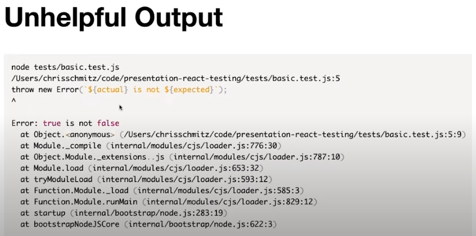
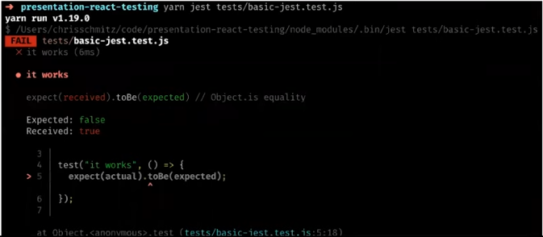

### What is a test?

Code you write to verify the behavior of your application

### Why write tests?

Serves as documentations. Tests are a specifications for how our code should work.

### Consistency

Verify that engineers are following best practices and conventions for your team. Name your files a certain way, code a certain way consistently.

### Productivity

We write tests because it allows us to ship quality code faster.

### Types of Tests

- **End-to-End**: Spin up your app and simulate user behavior. Kind of like a robot performing a task in your app.
- **Integration**: Verify that multiple units work together.
- **Unit**: Verify the functionality of a single function/component.
- **Static**: Cath typos and errors while writing code. TypeScript, Eslint, etc.

## React Component Tests

### Basic test

```javascript
const expected = true
const actual = false

if (actual !== expected) {
  throw new Error(`${actual} is not ${expected}`)
}
```



The above doesn't help us much, so we can use a tool called [JEST](https://jestjs.io/) which a testing framework which helps us with this:

### Jest test

```javascript
const expected = true
const actual = false

test('it works', () => {
  expect(actual).toBe(expected)
})
```

Which outputs:



## Actual Testing with JEST

We're testing TODO APP:

```javascript
import * as React from 'react'

export const App = () => {
  const [items, setItems] = React.userState([])
  const [text, setText] = React.useState('')

  const handleChange = e => setText(e.target.value)

  const handleSubmit = e => {
    e.preventDefault()

    if (!text.length) {
      return
    }

    const newItem = {
      text,
      id: Date.now(),
    }

    setText('')
    setItems(items.concat(newItem))
  }

  return (
    <div>
      <h1>TODO</h1>
      <ul>
        {items.map(item => {
          ;<li key={item.id}>{item.text}</li>
        })}
      </ul>

      <form onSubmit={handleSubmit}>
        <label htmlFor="new-todo">What needs to be done?</label>
        <br />
        <input id="new-todo" onChange={handleChange} value={text} />
        <button>Add #{items.length + 1}</button>
      </form>
    </div>
  )
}
```

Lets test:

```javascript
import * as React from 'react'
import * as ReactDOM from 'react-dom'
// import {getQueriesForElement} from "@testing-library/dom"

import { App } from './App'

test('renders to correct content', () => {
  // Check if it renders
  const root = document.createElement('div')
  ReactDOM.render(<App />, root)

  // Use DOM API (querySelector) to make assertions
  expect(root.querySelector('h1').textContent).toBe('TODO')
  expect(root.querySelector('label').textContent).toBe('What needs to be done?')
  expect(root.querySelector('button').textContent).toBe('Add #1')
})
```

Notice how we're not testing the USER interaction with the DOM. Now lets see an easier way to do what we did above:

```javascript
import * as React from 'react'
import * as ReactDOM from 'react-dom'
import { getQueriesForElement } from '@testing-library/dom'

import { App } from './App'

test('renders to correct content', () => {
  // Check if it renders
  const root = document.createElement('div')
  ReactDOM.render(<App />, root)

  const { getByText, getByLabelText } = getQueriesForElement(root)

  // Use testing-library-dom to make assertions
  getByText('TODO')
  getByLabelText('What needs to be done?')
  getByText('Add #1')
})
```

Now lets use `react-testing-library`:

```javascript
import * as React from 'react'
import { render } from '@testing-library/react'

import { App } from './App'

/* 
What render, method of RTL is
const render = component => {
    const root = document.createElement("div")
    ReactDOM.render(component, root)
    return getQueriesForElement(root)
}
*/

test('renders to correct content', () => {
  const { getByText, getByLabelText } = render(<App />)

  // Use react-testing-library to make assertions
  getByText('TODO')
  getByLabelText('What needs to be done?')
  getByText('Add #1')
})
```

Lets simulate the User's interaction:

```javascript
import * as React from 'react'
import { render, fireEvent } from '@testing-library/react'

import { App } from './App'

test('renders to correct content', () => {
  const { getByText, getByLabelText } = render(<App />)

  // Use react-testing-library to make assertions
  getByText('TODO')
  getByLabelText('What needs to be done?')
  getByText('Add #1')
})

test('allows users to add items to their list', () => {
  const { getByText, getByLabelText } = render(<App />)

  const input = getByLabelText('What needs to be done?')
  fireEvent.change(input, {
    target: {
      value: 'RTL Presentation Slides',
    },
  })
  fireEvent.click(getByText('Add #1'))

  getByText('RTL Presentation Slides')
  getByText('Add #2')
})
```

`@testing-library/user-event` helps us simulate user interaction in better way.

Lets check how we can test async code:

```javascript
import * as React from 'react'
import { render, fireEvent } from '@testing-library/react'

import { App } from './App'

import { api } from './api'
const mockCreateItem = (api.createItem = jest.fn())

test('renders to correct content', () => {
  const { getByText, getByLabelText } = render(<App />)

  // Use react-testing-library to make assertions
  getByText('TODO')
  getByLabelText('What needs to be done?')
  getByText('Add #1')
})

test('allows users to add items to their list', () => {
  const todoText = 'RTL Presentation Slides'
  mockCreateItem.mockResolvedValueOnce({
    id: 123,
    text: todoText,
  })
  const { getByText, getByLabelText } = render(<App />)

  const input = getByLabelText('What needs to be done?')
  fireEvent.change(input, { target: { value: todoText } })
  fireEvent.click(getByText('Add #1'))

  expect(mockCreateItem).toHaveBeenCalledTimes(1)
  expect(mockCreateItem).toHaveBeenCalledWith(
    '/items',
    expect.objectContaining({ text: todoText })
  )
})
```

## Conclusion

The objective of this post is to start talking about testing in depth, we checked a simple TODO app and how the user can interact with it, the objective of testing is to give the developer the reasurance that everything is working as it should, leading to less bugs. In the next posts we will be checking more advanced testing techniques.

See you on the next post.

Sincerely,

**Eng Adrian Beria.**
