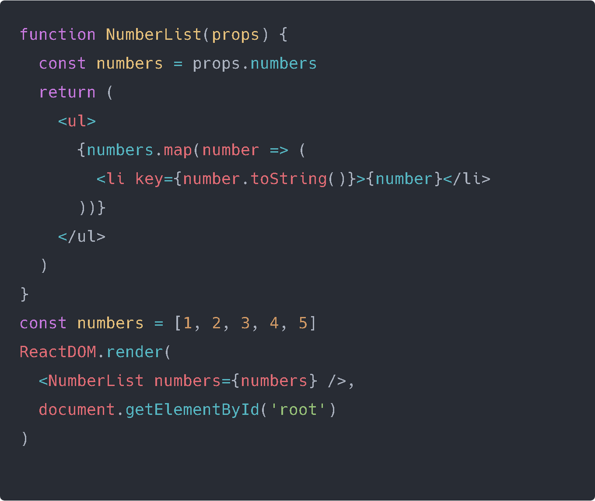
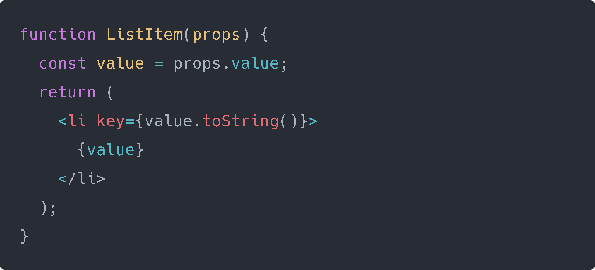
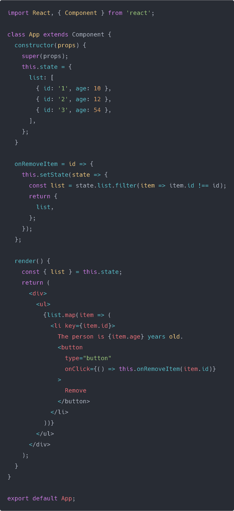

Most of the time you will be fetching Data from somewhere, either an external source like we did before with the Bitcoin Chart, or some data sent through the Backend. Said Data is generally an Object that we need to turn into arrays sometimes and then do some short of manipulation using Javascript. In this post we will go through some examples on how to deal with some common problems.

## Rendering a list of components

One of the first examples come from the documentation and it's something we will be doing a lot:

First we have a functional component **NumberList** which takes **props** which in the render we're passing the **array numbers**, so we define another numbers variable so we don't have to write **props.numbers** every time.

WAIT A SECOND! Isn't it **this.props.numbers**? Well you do not use the keyword **this**, since it’s not a class you don’t have to reference the component itself.

So here we have an array where we use the **.map()** method to take each value and do something with it, in this case we will put them inside a `<li></li>` tag.

WAIT ANOTHER SECOND! What is that **key**? 

> Keys help React identify which items have changed, are added, or are removed. Keys should be given to the elements inside the array to give the elements a stable identity.

It should be **unique**, it's not a good idea to define it always as the index if you know it will change.

> In practice, finding a key is not really hard. Most of the time, the element you are going to display already has a unique id. When that's not the case, you can add a new ID property to your model or hash some parts of the content to generate a key. Remember that the key only has to be unique among its siblings, not globally unique.

Lets check another example:

Is there a problem here? **YES!**

We don't actually need to define a key here, because there is only one element, if we had more then we would need.

> A good rule of thumb is that elements inside the `map()` call need keys.

## State as Array.

### Removing an item inside our state.

Lets work with a more practical case in manipulating our array. 

We're using filter in this case since we need to remove an item inside our array. In this case we take note of the id of the object and since the button is linked with the state through **item.id** which explores each object, when we press it we send the id to our function **onRemoveItem()** which updates our state and returns everything that isn't related to that id, which ends up removing the item selected.

Not going to go through adding or updating the state with a click, because for adding its using a simple concat and updating just using .map with spread operator to do what we need is enough.

We will continue this as a project in the other post where we will tackle Object manipulation as well. With the next project you should be able to handle any kind of weird Object distribution you encounter.

## Conclusion

So we learned a bit of Array Manipulation on this post and about the "key" element which is a way of React to keep track of what's changing so it's important you give it a unique identification. 

On the next post we will be handling a more complex JSON and how you could easily identify the best way to get the values you need.

See you on the next post.

Sincerely,

**Eng Adrian Beria.**