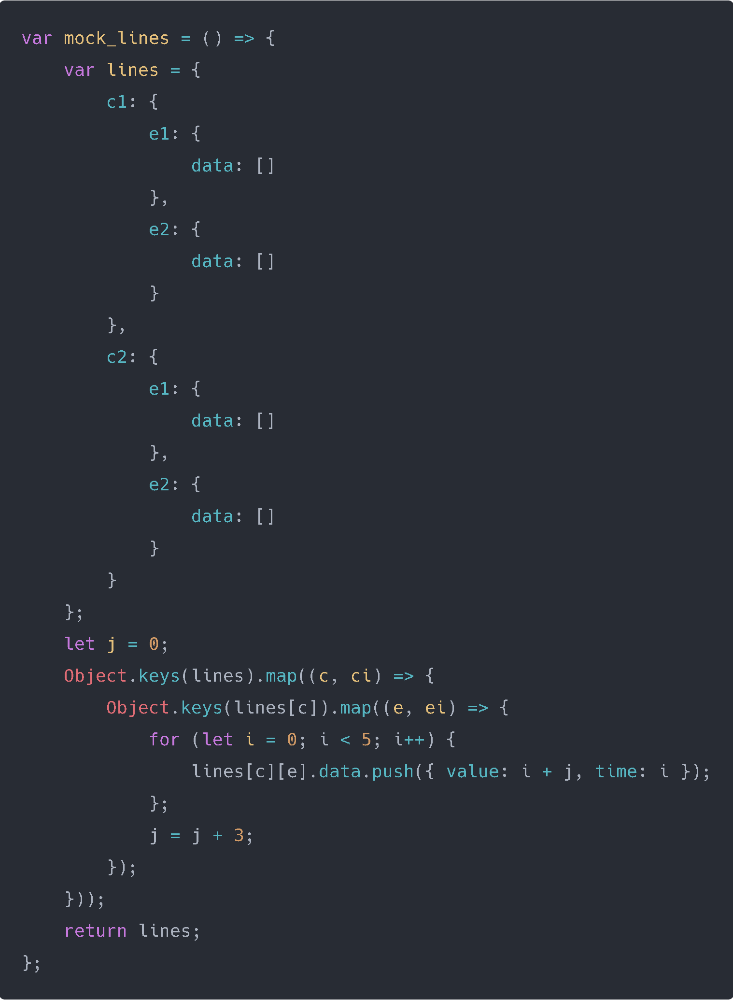
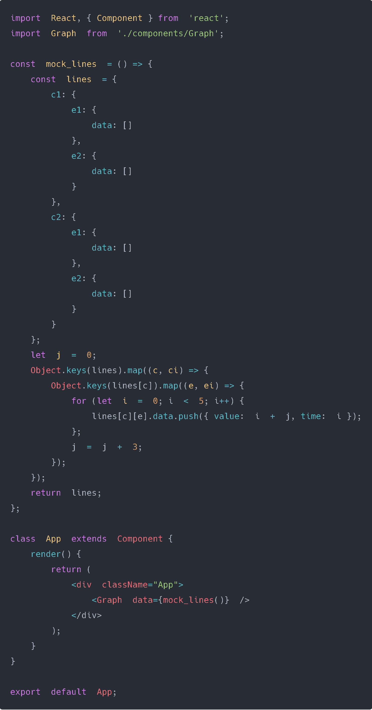
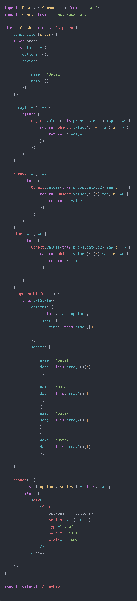
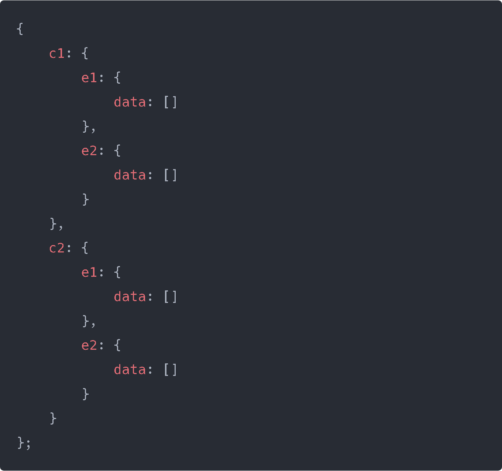
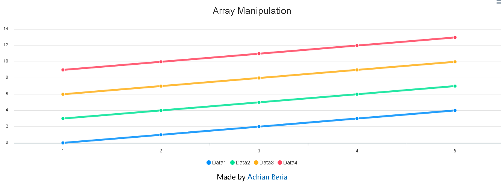

Lets imagine we're getting the following data we need to graph:

We're creating imaginary data and we want to graph each of those datas which have the following format:

    data: [{time, value},{time, value},{time, value}]

In total we would have four different lines to graph where the x-axis would be time and y-axis would be value.

On the x-axis will be the time and on the y-axis will be the four datas in c1 and c2 called **value**.

## Creating our enviroment.

First create a Projects Folder and open your terminal (you can use Windows CMD or Gitbash) and write the following command:

    npx create-react-app Bitcoin-Chart
    cd Bitcoin-Chart
    npm install --save react-apexcharts apexcharts
    npm start

Erase the files you don't need and make the same setup you did as the last project, copy the App.js and the component BitcoinChart which we will rename Graph.

## Lets work on our imaginary data

On App.js we will have the following code:

**mock_lines** is simply a function that returns the Object setup we will be working with, now we're seeing some now terminology here:

> **Object.keys(Obj)**  takes an object (Obj) and returns an array with its keys.
> **Object.values(Obj)**  takes an object (Obj) and returns an array with its values.

We will work with these a lot in our career as React Developers so its crucial to understand how to use them. Lets check line by line what we're doing:

    Object.keys(lines).map((c, ci) => {

We're taking the object **lines** and creating an array with its keys:

    [c1,c2]

Where c1 and c2 are objects. Now we use **.map()** to check each element in the array which are objects as well:

    Object.keys(lines[c]).map((e, ei) => {

Now we proceed on filling our imaginary data:

    for (let i = 0; i < 5; i++) { 
	    lines[c][e].data.push({ value: i + j, time: i }); 
	}; 
	j = j + 3;

What the code is doing is, on **c1** we're going inside the **e** objects and inside the data array to push an object **{ value, time }** and we're filling them. So for the first **c1** we go direct into the first **e1** and then into its data where inside the **for loop** we're doing this:

    {value: 0+0, time: 0}
    {value: 1+0, time: 1}
    {value: 2+0, time: 2}
    {value: 3+0, time: 3}
    {value: 4+0, time: 4}

On the next iteration for the **e2** inside **c1**:

    {value: 0+3, time: 0}
    {value: 1+3, time: 1}
    {value: 2+3, time: 2}
    {value: 3+3, time: 3}
    {value: 4+3, time: 4}

Now that **c1** is filled, the **.map()** goes to **c2** and fills the data the exact same way but with j = 6 by that point, for e1:

    {value: 0+6, time: 0}
    {value: 1+6, time: 1}
    {value: 2+6, time: 2}
    {value: 3+6, time: 3}
    {value: 4+6, time: 4}

Now for e2:

    {value: 0+9, time: 0}
    {value: 1+9, time: 1}
    {value: 2+9, time: 2}
    {value: 3+9, time: 3}
    {value: 4+9, time: 4}

And thats it. We now  pass the data as props inside the component which will be available as props, lets go inside!

## Inside our Chart component

This almost the exact same component of our first project, where options will be the same too but didn't put here due to being unnecesary.

For graphing the state will pretty much be the same according to Apex Chart documentation, but we need to find a way to explore the **this.props.data** we're sending to the Chart component. Since its an object:

We send that Object inside **Object.values**, where the parameter **c** will be:

    {
    	data: [{},{},{},{},{}]
    }

We pass that Object through another **Object.values**, where each **a** parameter will be:

    {value, time}

So if we do **a.value** we can get it! Now lets see whats inside array1, array2 and time:

    array1 = [
    	[0,1,2,3,4],
    	[3,4,5,6,7]
    ]
    array2 = [
    	[6,7,8,9,10],
    	[9,10,11,12,13]
    ]
    time = [
    	[0,1,2,3,4],
    	[0,1,2,3,4]
    ]

Now we our graphic will look like this:

## Conclusion

We learned how to get data inside a deep JSON just by using Object.values and .map(), knowing this is crucial and will save you many hours trying to figure out how to get the data, so simply writting it down in a piece of paper can help you figure out how to get that data. In future posts we will learn how to use GraphQL to get data that are much deep inside a more complex JSON and doing a simple Query we can get it without wasting time and code lines.

On the next post we will go into the big beast which is called Redux, its a state management that can seem very complex at first, but we will break it down so its much easier to digest.

See you on the next post.

Sincerely,

**Eng Adrian Beria.**