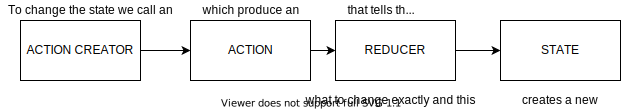
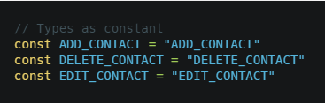
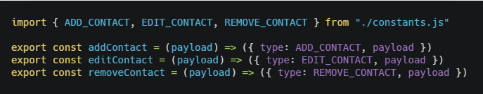
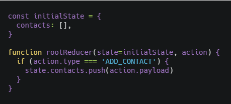
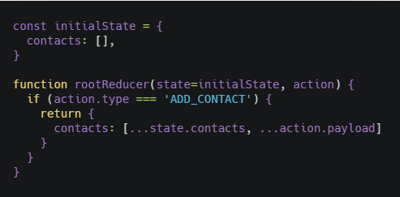

## What is Redux

According to the documentation:

> Redux is a predictable state container for JavaScript apps.

Its generally used with React when we need to make our state available for the whole app. The global state is stored inside an object tree called **STORE** and the only way to make changes (Create, Update and Delete) is with **ACTIONS** which is an object describing the change in the main state using **REDUCERS** which says how it will change.

The flow in which these three core concepts relate to each other is shown in the following diagram:



Seeing it like this its very simple in theory, you create a store, declare an initial state, create a rootReducer that will have all the reducers and use actions creators to **dispatch** actions to the reducer stating how the state will change.

Lets check some small concepts we need to grasp before creating our project:

### Actions Creators

Action creators simply create actions to be dispatched by your store to be processed by your Reducer.

You should use an Action Creator for convenience to prevent declaring an object each time you need to dispatch an action and this way we follow the DRY (Don't Repeat Yourself) principle. For example, imagine the following example:

```javascript
<button onClick={() => { dispatch({ type: 'MY_ACTION'); }}>
```

It is cleaner to write:

```javascript
<button onClick={() => { dispatch(myActionCreator()) }}
```

And it is more straightforward to understand too.

### Types as constant

Actions are objects that have a **type** and optionally a **payload**, where type is an object describing the action as a string in uppercase, but in modern projects we declare them as constants, the reasons are explained by Redux author Dan Abramov:

> Why is this beneficial? It is often claimed that constants are unnecessary, and for small projects, this might be correct. For larger projects, there are some benefits to defining action types as constants:

> 1. It helps keep the naming consistent because all action types are gathered in a single place.

> 2. Sometimes you want to see all existing actions before working on a new feature. It may be that the action you need was already added by somebody on the team, but you didn’t know.

> 3. The list of action types that were added, removed, and changed in a Pull Request helps everyone on the team keep track of scope and implementation of new features.

> 4. If you make a typo when importing an action constant, you will get undefined. This is much easier to notice than a typo when you wonder why nothing happens when the action is dispatched.

So, what we do is having a file named **constant.js** where we declare all the constants and just import them in our action creator files.





You might be thinking, but why not having those constants in the same action creators file? Because of the point number 1 made by Mr Abramov, having all the action types in one place is better for organization and for everyone to be on the same page, especially on big applications where you will have to use modals or even toasts the Redux way, but more on that on other posts.

### Reducer

Lets talk a bit more about Reducers, when they recieve an action they say how exactly the state will change, but generally we need to be careful to not violate one of Redux principles, **immutability**. 

> An immutable object is an object whose state cannot be modified after it is created.

Lets check the following examples:



This is the WRONG WAY, because we're modifying the original state, so we do it this way:



Spread operator is commonly used and its more elegant than Object.assign, which is one of the most common alternatives.

To organize our reducers we generally have a rootReducer where we import all our reducers into that file and then we import that rootReducer into our store.

### react-redux important functions

Redux on can be used with React or with Vanilla Javascript, this post is focusing more on React so there are several things I'm not talking about like subscribe, dispatch, getState, since we will take on a more practical look we will focus instead on what we be using more often and its a source of confusion by many people learning Redux for the first time.

- **mapStateToProps**: You use this inside a component or page and make it read a specific part of the store's state as props.
- **mapDispatchToProps**: You use this to dispatch action creators, you import the AC inside the component and then use mapDispatchToProps to use it as props.
- **connect**: Connects a React component to the Redux store and you can connect mapStateToProps and mapDispatchToProps on it as well.

## Conclusion

We learned about Redux principles in very few texts, but to truly grasp it we need to create a project, we're actually gonna do two, one will be a small project where we will use all the concepts we learned today and for async we will use Redux Thunk. For the other project we will use Redux Saga, Selectors and Models, all of these concepts we will learn them in another post before doing said project.

See you on the next post.

Sincerely,

**Eng Adrian Beria.**