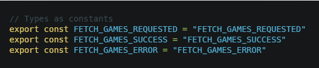
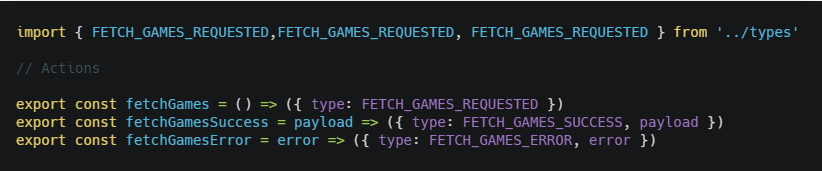
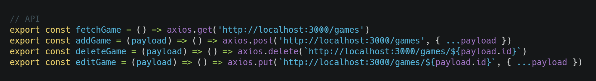
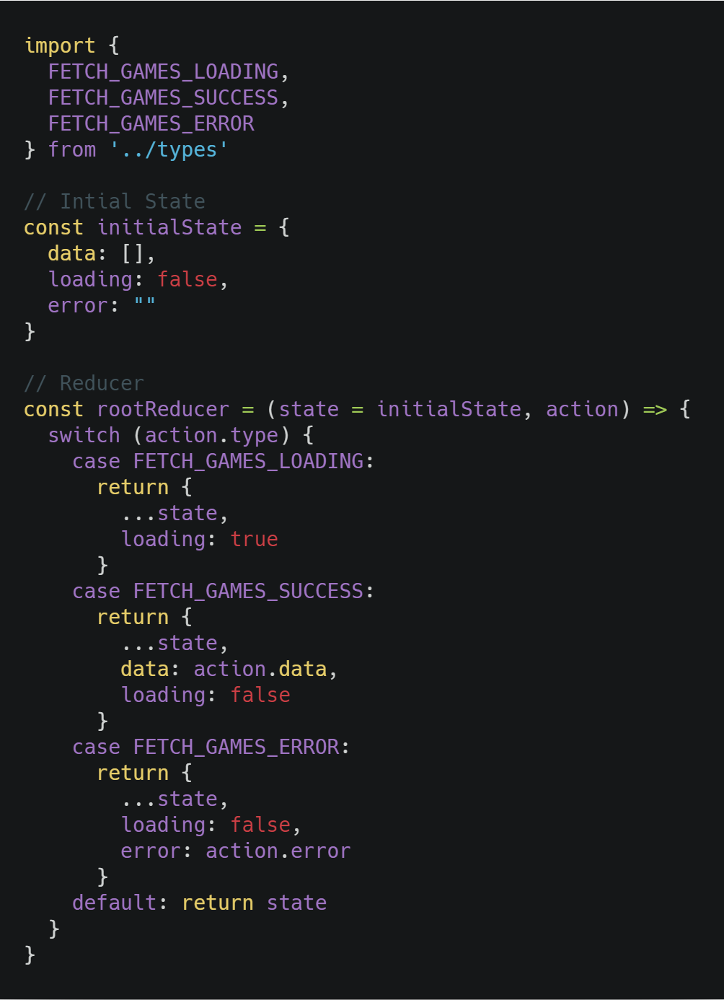
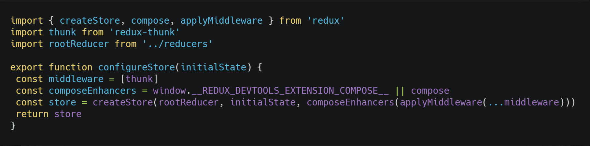
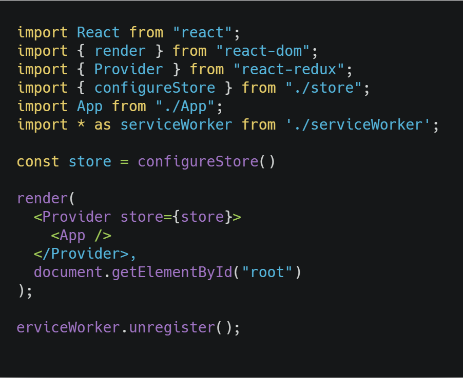
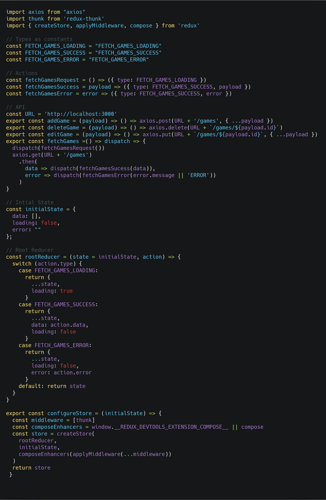

## Introduction

Redux Thunk middleware allows you to write action creators that return a function instead of an action. The thunk can be used to delay the dispatch of an action, or to dispatch only if a certain condition is met. The inner function receives the store methods dispatch and getState as parameters.

## What is a middleware

The middleware sits in between the dispatch and reducers, which means we can alter our dispatched actions before they get to the reducers or execute some code during the dispatch.

## When to use

When we need to do any kind of asynchronous logic, we generally pair it with axios, which is a library for making HTTP requests. One of my favorite reasons to use axios over ES6 fetch is that with axios you don't have to do convert the data you obtained from your request using .json(), axios does this automatically, for example:

    fetch(url).then(response => response.json()).then(data => console.log(data))

    axios.get(url).then(response => console.log(response))

## Installing dependencies

For an alredy created project:

    yarn add redux react-redux

If you're doing some async

    yarn add axios redux-thunk

## Project structure

- src
  - actions
  - api
  - components
  - pages
  - reducers
  - store
  - types
  - App.js
  - index.js

Each folder will have an index.js file inside.

## Types

Inside the types folder we add our constants

## Actions

Inside the actions folder we add our actions creator, importing the constants we made.

## API

This is where we will use axios, we will do all our requests on these folders and it will look like this.

The URL we're using is a server we created using JSON Server which gives us a service with information we can do CRUD operations to, when we build the next project we will see this in more detail.

## Reducer

This is where our reducer will be, anytime we dispatch an action in our app, the reducer recieves the command to change the global state

Notice how it only does something when we do only a fetch request, its because our POST, DELETE and PUT will only do a HTTP request and won't mess with the global state, but when we do a GET the app will reload.

## Store

This is where our store will be configured.

Not much to see, we create the store taking as arguments the rootReducer, the initial state and with composeEnhancers we can add several middlewares like Redux Thunk.

## Connect Store to Provider

We configure our store importing the setup from store folder.

## A summary

- Create folders with the following name: types, actions, reducer, store, api.
- Inside types we add our constants.
- Import types inside our actions folders and export the action creators.
- If you're doing an asynchronous request, then inside api add your requests.
- Configure your store.
- Connect it to Provider

## Ducks pattern

Another way of making this process even easier, is to use put everything on a single file, but of course I don't mean EVERYTHING, but if in your app you're working with getting a set of posts or comments in a blog, then you can do two ducks files. In the case of this tutorial we were only doing it for a set of games, which we will see in detail in another post, but for now lets see how a ducks pattern would look here:

Don't worry about the URL looking so awkward, its just to showcase where its coming from.

As you can see this pattern makes everything more smooth and its recomended in the Redux documentation.

## Conclusion

We learned how to setup a Redux structure in our React app, its very straightforward when you start doing it, but there are even easier ways of doing this kind of setup, with a ducks pattern (everything on a single file) as we just saw and using the new Redux Toolkit which we will see later.

See you on the next post.

Sincerely,

**Eng Adrian Beria.**