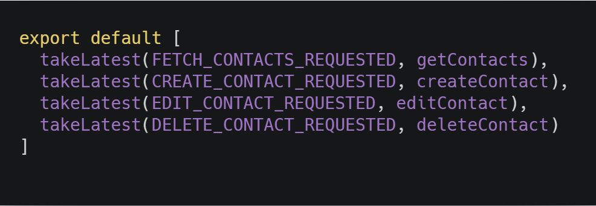
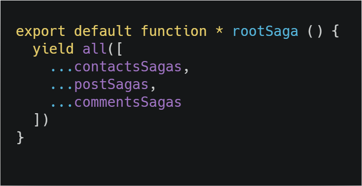

## Introduction

A saga is like a separate thread in your application that's solely responsible for side effects. redux-saga is a redux middleware, which means this thread can be started, paused and cancelled from the main application with normal redux actions, it has access to the full redux application state and it can dispatch redux actions as well.

It uses an ES6 feature called Generators to make those asynchronous flows easy to read, write and test. By doing so, these asynchronous flows look like your standard synchronous JavaScript code.

You might've used redux-thunk before to handle your data fetching. Contrary to redux thunk, you don't end up in callback hell, you can test your asynchronous flows easily and your actions stay pure.

## When to use

When we need to do any kind of asynchronous logic, its also prefered on big apps that requires the user to dispatch a lot of actions making Saga ideal for testing and controlling the flow in a more efficent way.

## What are Generators

With ES6, we have been introduced with a special type of functions called generators. With generators, the functions can be paused in the middle multiple times and resumed later which allows other codes to run in between.

Inside the generator function, we use a special keyword called yield which is used to pause the function inside itself.

So, a generator function can be stopped and restarted as many times as we like.With normal functions, we get parameters in the beginning and a return statement in the end. With generator functions, you send messages out with each yield, and you send messages back in with each restart.

The syntax of generator function is like this —

```javascript
function* abc()
  // code here
}
```

It doesn't admit arrow functions sadly, so this is the only way we can make a Generator function, the * symbol is what tells Javascript this is a generator, it uses a special keyword called **yield** to perform any action or **effect**. Redux Saga gives us several effects, lets check them up.

## Redux Saga effects

Lets take a look at the most used ones:

```javascript
function* saga() {
  yield take(ACTION)                       // Instructs middleware to wait for a specific action
  yield takeEvery(actionType, workerSaga)  // Spawn a worker saga for each actionType
  yield call(ApiFn, ...args)               // Used to make an async call
  yield put(ACTION)                        // Triggers an action which is sent to the reducer
  yield all([ ...sagas ])                  // Can run multiple sagas. Takes an array of sagas
}
```

Remember an action is an object with { type, payload }, with payload being optional. In the case of takeEvery you only need the action.type.

We generally use two different sagas:

- Watcher Saga: We can use takeEvery or takeLatest, when we dispatch an action it gets read by the watcher and connects with a worker saga.
- Worker Saga: When you dispatch an action it does something.

Lets see an example of both:


One thing I was thinking when learning Redux Saga was "shouldn't I call a requested action before doing a call in the worker saga?", well its alredy done by the watcher saga! So once the requested action is dispatched the worker can start working.

So why do we need the action creator fetchingGames? Its used in our component to make the request to the watcher saga to start the fetching.

## Installing dependencies

For an alredy created project:

    yarn add redux-saga

## Project structure

We're gonna do a ducks pattern here.

- src
  - api
  - components
  - pages
  - sagas
  - App.js
  - index.js

Each folder will have an index.js file inside.

## API

This is where we will use axios, we will do all our requests on these folders and it will look like this.


The URL we're using is a server we created using JSON Server which gives us a service with information we can do CRUD operations to, when we build the next project we will see this in more detail.

I added examples for POST, PUT and DELETE, but this post will focus on a fetch which is one of the most common features in every app.

## Saga

We will do a ducks pattern here, as we said in the redux-thunk post, you can have different sagas doing different things, for example, you might have a contacts saga that works doing a CRUD just for contacts. You can have another saga for handling the posts of a blog. Each saga will have its respective types, action creators, watcher and worker saga and reducer.

If you have more than one saga then its adviced you create the store in a separate folder called "store" in the src folder.

In this file we will have types, actions, reducer and the sagas!


The types and actions are straight forward. One thing to take notice is that with Redux Saga we work using only ACTIONS to trigger the worker saga, for example, if we wish to request information from a server, inside one of our components we need to import the ACTION CREATOR and when it triggers the dispatch (due to mapDispatchToProps), the watcher saga takes notice and sends a worker to make the HTTP request **call** and then takes the result and **put** the action creator to work sending the data obtained from the **call** as argument to the action creator which is read by the Reducer and adds the data to the store (global state).

If we need to make any change to the global state, then we need to use another worker saga and repeat the process.

## Handling multiple Sagas

As I previously mentioned, in big apps we're gonna be using different sagas to handle different entities in the application, the folder structure will look like:

- src
  - api
      - contacts.js
      - posts.js
      - comments.js
  - components
  - pages
  - reducers
  - sagas
      - contacts
          - sagas
            - createContact.js
            - editContact.js
            - deleteContact.js
            - getContact.js
            - index.js
          - actions.js
          - index.js
          - initialState.js
          - reducer.js
          - types.js
      - posts
      - comments
      - index.js
  - store
  - App.js
  - index.js

Wait... This looks more complicated! It sure does look like it, but its the same logic we did, we're just separating them. Inside the **contacts/sagas folder** we will have the four worker sagas and inside index.js we will have the watcher saga for each of them and it will look like this:



Where we export this as **contactsSaga** towards our src/saga/index.js file which will look like:



Where the other sagas are similar to contactsSaga. We also export our reducer towards **src/reducer**, we do the same with the reducer of posts and comments, applying **combineReducer** afterwards.

Or you can do a ducks pattern:

- src
  - api
      - contacts.js
      - posts.js
      - comments.js
  - components
  - pages
  - ducks
      - contacts
          - index.js
      - posts
          - index.js
      - comments
          - index.js
      - index.js
  - reducer
  - store
  - App.js
  - index.js

Inside our **contacts/index.js** we will have all the logic inside, we declare our types, our action creators, watchers and workers saga, our reducer with the respective initial state which we will export towards **src/reducer** and apply **combineReducer** afterwards.

I personally prefer the ducks pattern for structuring folders.

## A summary

- Create folders with the following name: api, sagas.
- Inside api we add our requests to the server.
- In sagas we declare types, actions, reducer, watcher saga, worker saga and configure our store.
- Connect it to Provider.

## Conclusion

We learned how to setup a Redux structure with Redux Saga in our React app, it can be a bit overkill for simple apps, but in general its very easy to use and its a matter of preference, but in the next post we will see why Redux Thunks is prefered for most apps when used with the brand new Redux Toolkit.

See you on the next post.

Sincerely,

**Eng Adrian Beria.**